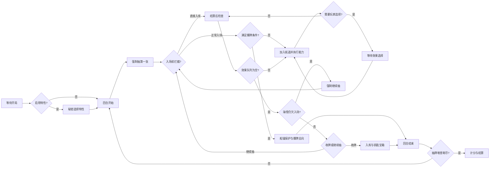

# 《亡命神抽》Game Hall 实现方案

## 1. 交付目标

目标是把规则实现成一个服务端权威、可重连、可观战、可审计的 `game-hall` 插件。客户端只负责显示安全视图和提交意图；洗牌、合法选项、爆牌、能力连锁、得分与胜负全部由服务端决定。

首个可发布版本应完整支持：

- 2–4 位真人玩家；
- Mayday 实体基础规则；
- 60 张战利品牌和 17 张基础特性牌；
- 随机首家／房主首家；
- 断线重连、只读观战、战绩和再来一局；
- 桌面与手机响应式牌桌；
- 可选数字安全档案、美人鱼能力版和七项网页变体。

十周年纪念版专属卡、单人 AI、教程关卡、双特性和任意多变体叠加不进入首版范围。

## 2. 推荐插件结构

```text
plugin-dead-mans-draw/
├── manifest.json
├── README.md
├── backend/
│   ├── plugin.py
│   ├── engine.py          # 生命周期、动作入口和视图投影
│   ├── state.py           # dataclass／TypedDict 权威状态
│   ├── catalog.py         # 加载并索引 card-catalog.json
│   ├── reducer.py         # 原子区移动、入场、爆牌和收牌
│   ├── effects.py         # 十种花色与特性调度
│   ├── scoring.py         # 基础、特性与变体计分
│   └── rng.py             # 可复现洗牌与选择
├── frontend/
│   ├── GameView.vue
│   ├── types.ts
│   ├── composables/useDeadMansDraw.ts
│   ├── components/
│   │   ├── LootCard.vue
│   │   ├── PlayLane.vue
│   │   ├── PlayerBank.vue
│   │   ├── TraitBadge.vue
│   │   ├── EffectChoice.vue
│   │   ├── ScoreBreakdown.vue
│   │   └── RuleProfileBadge.vue
│   └── assets/catalog-dark.webp + catalog-light.webp
└── tests/
    ├── test_setup.py
    ├── test_suits.py
    ├── test_traits.py
    ├── test_profiles_and_variants.py
    ├── test_views.py
    ├── test_full_game_simulation.py
    └── GameView.test.ts
```

本建模目录中的 `model/` 与 `assets/` 可复制到插件内部。正式插件不要直接跨目录导入本建模包。

## 3. Manifest 建议

| 字段 | 建议值 |
| --- | --- |
| `id` | `plugin-dead-mans-draw` |
| `name` | `亡命神抽` |
| `players` | `min: 2, max: 4` |
| `roomLayout` | `immersive` |
| `capabilities.guests` | `true` |
| `capabilities.spectators` | `true` |
| `capabilities.firstPlayer` | `true` |
| `capabilities.undoActions` | `[]`，任何动作都可能暴露牌序，不能撤销 |
| `records.scoreKind` | `outcome` |

推荐房间选项：

```json
{
  "listed": true,
  "allowGuests": true,
  "allowSpectators": true,
  "firstPlayer": "random",
  "rulesProfile": "tabletop_base_2015",
  "traitsEnabled": true,
  "globalVariant": null,
  "turnTimeoutSeconds": 60
}
```

服务端必须重新校验互斥项。`rules-profiles.json` 中 `allowedCombinations` 以外的组合拒绝开局。

## 4. 权威状态机



`phase` 建议只描述稳定停顿点：

- `waiting`：尚未开局；
- `trait_selection`：等待玩家私密选特性；
- `turn`：可以抽牌或收牌；
- `effect_choice`：等待当前玩家解决服务端给出的选择；
- `finished`：已结算。

动画不是服务端阶段。服务端返回事件序号，前端自行播放表现，不能因动画阻塞规则状态。

## 5. 区域与组件守恒

每个战利品牌实例 ID 必须且只能位于一个区域：

- `drawPile`：有序且隐藏；
- `discardPile`：内部有序，公共视图只公开内容与数量，不公开随机顺序；
- `playArea[*].cardId`：有顺序且公开；
- `players[*].bank[suit][*]`：公开；
- `turn.mapReveal[*]`：暂存的公开候选；
- `turn.bustingCardId`：爆牌原子结算期间的临时位置；
- `removedFromGame`：美人鱼替换或本局未使用的组件。

基础牌池始终包含 60 个唯一实例。美人鱼变体仍是 60 张，只交换 8、9 与 2、3。每次动作结束后校验并集数量为 60、交集为空。

特性牌分别位于 `traitDeck`、玩家 `traitOffer`、玩家 `traitId` 或 `unusedTraits`。未选特性永不回到本局。

## 6. 动作协议

| Action | Payload | 可用阶段 | 服务端责任 |
| --- | --- | --- | --- |
| `choose_trait` | `{ "traitId": "trait-navigator" }` | `trait_selection` | 必须属于本人私密两张候选；选择后清除候选 |
| `choose_locker_target` | `{ "playerId": "p3" }` | `trait_selection` 的附属步骤 | 只能由魔柜拥有者选择一名对手 |
| `draw` | `{}` | `turn` | 当前玩家、效果队列为空且抽牌合法；海怪强制时也是此动作 |
| `collect` | `{}` | `turn` | 航道非空、无待选效果且 `krakenDebt == 0` |
| `resolve_effect` | `{ "choiceId": "choice-17", "optionId": "option-2" }` | `effect_choice` | 选项必须来自服务端当前选择且属于当前玩家 |

效果目标统一为服务端发放的 `optionId`，而不是接受任意牌 ID。安全视图可以给每个选项附上公开展示数据，例如 `{ playerId, suit, card }`；权威映射只存在服务端。这能同时阻止越权目标、过期点击和构造隐藏牌 ID。

每个动作都检查 `state.revision`。客户端可以附带看到的 revision；落后请求返回可重试错误，不进行部分写入。

## 7. 效果队列

不要用递归 UI 回调实现连锁。服务端维护 FIFO／栈式混合的显式 `effectQueue`：

```json
{
  "effectId": "effect-31",
  "kind": "enter_card",
  "actorId": "p2",
  "cardId": "loot-hook-6",
  "source": { "zone": "draw", "ownerId": null },
  "parentEffectId": null,
  "countsTowardKraken": true
}
```

推荐入口函数：

```text
enter_card(card, source, actor, parent):
  1. 原子锁定并从来源区移除卡牌
  2. 应用“进入航道前”特性（风流船长、渔夫）
  3. 计算当前档案的爆牌键（花色或点数）
  4. 若重复：记录 bustingCard，立即进入爆牌结算
  5. 否则追加 playEntry，并抵扣既有 krakenDebt 一次
  6. 按规则增加该牌产生的新债务或保护标记
  7. 生成被动特性拦截器和基础花色效果
  8. 自动结算，遇到玩家选择时暂停
```

海怪数量的顺序非常重要：一张为旧海怪要求而入场的新海怪，先抵扣旧债务 1，再新增 2（或 4）。因此债务可能从 1 变为 0，再变为 2。

## 8. 规则优先级

每张牌按以下顺序裁决：

1. **组件替换**：美人鱼变体先决定本局实际卡表和能力表。
2. **入场前个人特性**：风流船长／渔夫可能直接入库；直接入库不触发爆牌和基础能力。
3. **爆牌档案**：按花色或点数检查；爆牌牌不执行后续能力。
4. **成功入场**：记录顺序、来源、父效果，抵扣既有海怪数量。
5. **保护规则**：船锚、守财奴、安全港更新保护集合。
6. **对手被动特性**：哑火、格挡、驯兽师、海妖等替换或拦截效果。
7. **当前玩家强化特性**：领航员、剑术大师等修改合法选项或效果数量。
8. **基础花色能力**：生成自动效果或服务端选择。
9. **入库／爆牌后规则**：钥匙宝箱、魔柜、贼岛、猝死检查。

基础规则每人仅一项特性，可避免同一玩家的强化特性互相组合。不同玩家的主动／被动特性仍可能冲突，`rules-profiles.json` 必须列出优先级。

## 9. 船锚保护模型

不要仅保存一个“最后船锚索引”。建议在每个 `playEntry` 上保存稳定的 `entryId`，并在 `turn.protectedEntryIds` 中保存集合。

- 基础船锚入场：把它之前所有现存 entry 加入保护集合。
- 美人鱼移动船锚：按移动后的顺序重新扩展该船锚保护的前缀。
- 安全港：船锚自身立即受保护，并为之后两个**成功入场** entry 建立槽位；爆牌牌未成功入场，不消耗槽位也不受保护。
- 守财奴：抓钩与抓钩直接带入的 entry 加入保护集合，后续连锁牌不自动受保护。
- 海妖／变体风流船长拿走船锚：不删除已经加入集合的 entry。

爆牌时以集合为唯一事实来源。先入库受保护 entry，再处理剩余航道和 bustingCard。

## 10. 随机性与审计

洗牌、特性发牌、地图候选、钥匙宝箱奖励和掠夺者随机取牌都必须使用服务端 RNG。

建议每局创建 256 位随机种子，仅保存在权威状态；同时在公共状态保存 `seedCommitment = SHA-256(seed + roomId + gameNumber)`。终局战绩可以保存种子或仅保存可重演事件，取决于平台隐私政策。测试中注入固定种子，确保每个失败都可复现。

事件日志只记录玩家当时有权知道的内容：

- 可以记录公开入场牌、公开目标、爆牌依据、银行移动和得分；
- 不记录未选特性、未来抽牌顺序或随机候选之外的弃牌顺序；
- 终局也不必公开从未被预览的牌序。

## 11. 安全视图

`view(room, viewer)` 是唯一信息边界。

| 数据 | 当前玩家 | 其他玩家 | 观众 |
| --- | --- | --- | --- |
| 自己尚未选择的特性候选 | 可见 | 不可见 | 不可见，即使固定该玩家视角 |
| 已选择特性 | 所有人完成后公开 | 公开 | 公开 |
| 抽牌堆顺序 | 不可见 | 不可见 | 不可见 |
| 抽牌堆数量 | 可见 | 可见 | 可见 |
| 银行与航道 | 完全公开 | 完全公开 | 完全公开 |
| 地图候选／水晶球预览 | 公开 | 公开 | 公开 |
| 当前效果合法选项 | 行动者可提交 | 可只读查看公开说明 | 可只读查看公开说明 |
| RNG 种子 | 不可见 | 不可见 | 不可见 |

视图绝不返回内部 `effectQueue`、来源区索引、抽牌堆数组、未公开特性或 `optionId → 隐藏对象` 映射。

## 12. 计分流水线

按固定顺序计算并返回分项：

1. 给每张银行牌应用卡牌级修正，例如金鳞 `+5`。
2. 应用聚合规则：基础为每花色最高；宝藏堆为全部相加。
3. 应用终局修正：全员上甲板每缺一色 `-5`。
4. 应用资格规则：浪下求生排除 `score >= 60`；无人合格则全员和局。
5. 比较总分。
6. 基础同分比较银行总牌数；仍同分共享胜利。

猝死赛在任何原子入库完成后运行同一流水线的前两步；首次达到 50 的玩家立即结束游戏。一次原子操作只能有一个当前受益玩家，因此不会产生同时跨线。

`player_result()` 写入胜／负／和，`record_state()` 至少保存规则档案、变体、最终逐花色分项、银行总牌数、回合数和结束原因。

## 13. 前端实现

### 13.1 场景骨架

`GameView.vue` 只做布局编排和宿主动作接入；卡牌、银行、航道和选择面板拆成独立组件。场景按 `model/scene-catalog.json` 的 1600×900 逻辑坐标映射到 CSS 容器。

- 宽屏：三名对手沿上、左、右边缘；自己的银行固定在底部；抽牌／弃牌位于中央两侧，航道横向展开。
- 平板：对手银行缩为可展开条，航道仍保持横向主视觉。
- 手机：中央航道允许容器内横向滚动，页面本身不得横向溢出；自己的银行使用 5×2 网格，对手使用摘要卡。

### 13.2 操作反馈

- `draw` 是主要按钮；有爆牌风险时不弹二次确认，保持游戏节奏。
- `collect` 在海怪债务或待选效果存在时禁用，并显示具体原因。
- 实体档案中会爆牌的强制选项保留为可点击红框；数字安全档案根本不下发这些选项。
- 当前选择必须显示来源、目标区域和结果预览，例如“从白露的火炮堆取走 7”。
- 所有动画由递增 `eventSeq` 驱动；重连时跳过已确认的旧动画，直接渲染当前快照。

### 13.3 视觉资产

运行时卡面应从 `card-catalog.json` 的图标、色板和点数构造，避免 60 张手工维护。大厅图标需要另行制作 768×768 深浅 WebP；本包 SVG 只能用作信息架构原型，不能直接冒充发布级官方美术。

## 14. 异常与超时

- 非当前玩家、过期 `choiceId`、非法 option、抽空牌堆、海怪未清零时收牌等请求统一抛 `GameRuleError`。
- 动作必须事务化：任何能力链抛错时回滚到动作前状态，不能留下“卡牌已离开来源但未到目标”的半状态。
- 当前玩家断线不改变规则。平台时限到达后，服务端执行保守默认：能收牌则收牌；不能收牌则抽牌；效果选择从稳定排序后的合法选项中用服务端随机选择。
- 玩家退出按大厅既有多人游戏退出策略结算，不把牌临时转给其他玩家；若平台没有中途退出约定，首版应禁止开局后主动退出。

## 15. 测试矩阵

### 15.1 单元规则

- 准备区精确为抽牌 50、弃牌 10，卡牌总数和 ID 唯一。
- 十种花色各自的空目标、单目标、多目标、连锁与爆牌路径。
- 爆牌牌不执行能力；抓钩／弯刀／藏宝图在实体档案可强制爆牌。
- 船锚、守财奴、安全港的保护集合，以及美人鱼移动／移除船锚。
- 海怪债务抵扣、新海怪叠加、能力牌抵扣、直接入库不抵扣、末牌裁决。
- 钥匙宝箱正常收牌、船锚后爆牌、弃牌不足、寻宝专家和掠夺者。
- 17 项基础特性逐项至少一个正例、一个无目标例；所有对手被动特性覆盖。
- 美人鱼 2／3 替换、重演、海妖和变体风流船长。
- 七项网页变体的得分或移动差异。

### 15.2 安全与重连

- 任一玩家视图都不能搜索到抽牌堆未来牌 ID、其他人的特性候选或 RNG 种子。
- 伪造牌 ID、玩家 ID、旧 revision、旧 choiceId 和他人 option 全部拒绝且状态不变。
- 在 `effect_choice`、海怪连锁、爆牌动画后和最后一张牌入场后重连，快照都能独立恢复界面。
- 战绩和回放状态不含隐藏数据。

### 15.3 完整对局仿真

对 2、3、4 人、三个规则档案、特性开关和每个允许变体运行固定种子机器人。每个动作后校验：

- 60 张战利品守恒；
- 银行排序正确；
- 没有悬空 choice 或负数海怪债务；
- 有限步内回合推进；
- 抽牌堆耗尽后必定到达 `finished`；
- 胜者和分项可由最终银行独立复算。

### 15.4 前端

在 1440×900、1024×768、768×1024、390×844 和 320×568 检查：

- 页面无横向溢出；
- 航道 1–10 张均可读；
- 2–4 人银行不重叠；
- 键盘焦点顺序、ARIA 标签、非颜色提示和减少动态模式；
- 爆牌、保护分流、攻击、随机奖励、海怪债务与终局分项动画。

## 16. 分阶段里程碑

1. **M0 模型冻结**：通过本目录 Schema 和跨模型校验，确认中文术语与规则档案。
2. **M1 基础引擎**：无特性实体基础版、完整 2–4 人仿真和安全视图。
3. **M2 特性系统**：17 项基础特性、效果队列与冲突优先级全覆盖。
4. **M3 前端可玩**：沉浸式牌桌、响应式布局、重连和规则引导。
5. **M4 可选规则**：数字安全档案、美人鱼能力版和七项网页变体。
6. **M5 发布验收**：大厅图标、插件验证、全量测试、生产构建和维护者注册。

## 17. 完成定义

只有在以下条件同时满足时才应修改根 `registry.json`：规则矩阵全绿；随机完整局无死锁；每次动作后组件守恒；隐藏信息扫描无泄漏；2–4 人与所有目标视口通过；规则 PDF、界面帮助和服务端实际裁决一致；名称与美术权利已由维护者确认。
