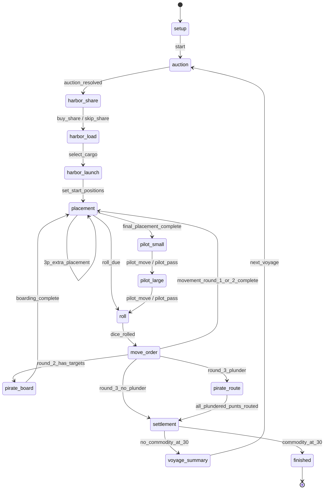

# 《马尼拉》社区插件实现方案

## 1. 交付定位

本方案把规则模型落地为本仓库的 `plugin-manila` 社区插件。当前目录只提供设计、Schema、示例与原创蓝图，不注册、不发布，也不假装已有可运行引擎。

第一版目标：

1. 完整实现 2005 基础规则和可选增强海盗变体；
2. 支持 3-5 人房间、游客、断线重连和共同获胜；
3. 所有随机、权限、资金、卡牌和结算由服务端权威处理；
4. 份额种类绝不进入对手或中立视图；
5. 在 320px 到宽屏桌面均能读清三条航线、玩家财务和当前决策；
6. 动画只解释结果，不成为规则计时器；
7. 不使用官方扫描图、Logo、卡面或版图插画。

## 2. 建议插件清单

实现阶段创建 `plugin-manila/manifest.json`，建议基线如下：

```json
{
  "$schema": "../plugin.schema.json",
  "apiVersion": 1,
  "version": "1.0.0",
  "author": "Game Hall Contributors",
  "license": "UNLICENSED",
  "id": "plugin-manila",
  "name": "马尼拉",
  "description": "3-5 人竞拍港务长、押注货船航程并经营货物份额",
  "category": "竞价策略",
  "tone": "manila-harbor",
  "roomLayout": "immersive",
  "players": {
    "min": 3,
    "max": 5,
    "label": "3-5 人"
  },
  "capabilities": {
    "guests": true,
    "spectators": false,
    "spectatorFrames": false,
    "firstPlayer": true,
    "undoActions": [],
    "drawRequests": false,
    "replay": false,
    "ai": false
  },
  "records": {
    "scoreKind": "outcome"
  },
  "defaultOptions": {
    "listed": true,
    "allowGuests": true,
    "allowSpectators": false,
    "firstPlayer": "random",
    "pirateDisplacement": false
  },
  "ruleLabels": [
    "3-5 人",
    "竞拍与部署",
    "三轮航行",
    "份额投资",
    "海盗与保险",
    "最高财富获胜"
  ]
}
```

`spectators` 暂时关闭，因为当前宿主可能把观众绑定为某个玩家视角。模型已经准备中立投影，等平台能证明不会泄露目标玩家份额后再开启。

## 3. 推荐目录

```text
plugin-manila/
├── manifest.json
├── README.md
├── backend/
│   ├── plugin.py
│   ├── engine.py
│   ├── state.py
│   ├── catalog.py
│   ├── rules.py
│   └── projection.py
├── frontend/
│   ├── GameView.vue
│   ├── types.ts
│   ├── components/
│   └── assets/
│       ├── catalog-dark.webp
│       └── catalog-light.webp
└── tests/
    ├── test_engine.py
    ├── test_privacy.py
    ├── test_rules_matrix.py
    └── GameView.test.ts
```

职责边界：

| 模块 | 责任 |
| --- | --- |
| `state.py` | 不含 UI 的权威状态 dataclass / TypedDict |
| `catalog.py` | 货物、成本、收益、价值轨和场景常量 |
| `rules.py` | 纯函数校验、移动、目的地、收益和财富计算 |
| `engine.py` | 宿主生命周期、动作路由、原子提交与结束 |
| `projection.py` | 本人、对手和未来中立观战视图的隐私裁剪 |
| `GameView.vue` | 根据 `sceneId` 呈现服务器快照和合法动作 |

## 4. 权威状态机



机器版本见 `model/state-machine.json`。自动事件只能由服务端规则函数产生，客户端不能发送 `auction_resolved`、`round_3_plunder` 或 `commodity_at_30`。

## 5. 核心领域对象

| 对象 | 关键字段 | 不变量 |
| --- | --- | --- |
| `ManilaState` | stage、voyage、players、punts、docks、movement | 所有权威真值集中在一个可序列化状态 |
| `PlayerLedger` | cash、shareIds、mortgagedShareIds、workers | 现金不为负；抵押集合是持有份额子集 |
| `AuctionState` | opener、leader、bid、active、passed | 报价严格递增；Pass 后不能重新加入 |
| `PuntState` | cargo、lane、position、status、occupants | 三艘船货物/航线唯一；航行坐标为 0-13 |
| `DockSlot` | kind、A/B/C、bettor、punt | 每个区域按 A -> B -> C 填充 |
| `MovementState` | round、dieResults、unresolvedPunts | 每枚骰只由对应货物船消费一次 |
| `PirateState` | captain、crew、candidates、routeQueue | 船长始终是海盗船最前方仍留守者 |
| `Settlement` | entries、deliveredCargo、marketAdvance | 每笔资金变化有来源、去向和原因 |

卡牌实例使用 `share-{commodity}-{01..05}`。抵押改变卡牌状态，不创建新的债务对象，也不移除份额所有权。

## 6. 动作协议

所有动作都应携带当前 `voyageNumber`；宿主若提供快照 revision，也一并校验，拒绝重放或过期动作。

| 动作 | 允许阶段/角色 | Payload | 服务端校验与结果 |
| --- | --- | --- | --- |
| `bid` | auction / 当前竞价者 | `{ amount, voyageNumber }` | 整数、严格加价、未 Pass、不高于可支付能力 |
| `pass_auction` | auction / 当前竞价者 | `{ voyageNumber }` | 移出活跃竞价者；剩一人时服务端结算 |
| `buy_share` | harbor_share / 港务长 | `{ commodityId }` | 供应非空、最多一张、按 `max(5,value)` 扣款 |
| `skip_share` | harbor_share / 港务长 | `{}` | 进入装货阶段 |
| `select_cargo` | harbor_load / 港务长 | `{ assignments }` | 三艘船、三种不同货物、货物存在 |
| `set_start_positions` | harbor_launch / 港务长 | `{ assignments }` | 航线唯一、坐标 0-5、总和 9 |
| `place_accomplice` | placement / 当前玩家 | `{ targetType, targetId }` | 空位、仍可部署、费用由服务端查表；货船必须最低价优先 |
| `pass_placement` | placement / 当前玩家 | `{}` | 本航行永久退出后续部署轮 |
| `take_loan` | 玩家拥有财务优先权 | `{ shareId }` | 本人持有且未抵押；现金 +12 |
| `repay_loan` | 玩家拥有财务优先权 | `{ shareId }` | 本人已抵押且现金至少 15 |
| `roll_dice` | roll / 港务长 | `{}` | 服务端为仍航行的三种货物生成 1-6 |
| `choose_move_order` | move_order / 港务长 | `{ puntIds }` | 必须是未结算船 ID 的完整无重复排列 |
| `pirate_board` | pirate_board / 当前海盗 | `{ puntId }` | 目标恰停 13；基础版要求空位；按船长先后 |
| `pirate_stay` | pirate_board / 当前海盗 | `{}` | 海盗留守，可能参与第三轮劫掠 |
| `pilot_move` | pilot_small/large / 对应玩家 | `{ moves }` | 小引航总量 1；大引航总量最多 2；目标未抵港 |
| `pilot_pass` | pilot_small/large / 对应玩家 | `{}` | 放弃本航行能力 |
| `route_plundered_punt` | pirate_route / 船长 | `{ puntId, destination }` | 只处理队首被劫船；destination 为 port/shipyard |
| `next_voyage` | voyage_summary / 任一在局玩家 | `{ voyageNumber }` | 总结已稳定且未终局；只接受第一次有效确认 |

成本、收益、骰点、移动坐标、分成和赢家从不出现在可信客户端 Payload 中。

## 7. 关键规则算法

### 7.1 开局发份额

1. 为四种货物各创建 5 张唯一份额。
2. 每种随机抽 3 张进入 12 张发牌池。
3. 安全洗牌后按座次每人发 2 张。
4. 发牌池未使用卡与每种未入池的 2 张一起进入公开供应。
5. 对手视图只返回每人的 `shareCount`，不返回卡牌 ID 或货物种类。

### 7.2 拍卖结算

胜者付款时：

1. 若现金足够，直接扣款；
2. 若不足，进入只对胜者可见的强制补款步骤，抵押所需份额；
3. 现金足够后原子扣除最终报价；
4. 不允许先成为港务长、后等待无限期付款。

首航全员 Pass 和同分规则按 `DIGITAL_ADAPTATIONS.md` 执行。

### 7.3 部署调度

服务端预生成部署到移动的节奏：

- 3 人：`P, P, M, P, M, P, PILOT, M`；
- 4-5 人：`P, M, P, M, P, PILOT, M`。

每个 P 都重新从港务长开始遍历座次，只跳过已 Pass、无助手或已离局玩家。完成一整圈才进入下一个调度项。

### 7.4 免票资格

先枚举当前玩家可正常进入的所有空位及成本，排除保险位。若：

`cash + 12 * unencumberedShares < min(legalCosts)`

则开放免票部署，实际收费为当前全部现金。没有合法空位时不能凭免票规则制造位置。

### 7.5 掷骰与移动

1. 服务端为每艘仍航行船生成对应骰点并持久化。
2. 港务长提交完整处理顺序。
3. 服务端逐船执行 `newPosition = oldPosition + die`。
4. `newPosition > 13` 时立即占据下一个港口位；否则保留 0-13 坐标。
5. 完成整轮后才检查第二轮登船或第三轮劫掠，避免客户端移动动画影响规则。

### 7.6 引航

- 小引航：恰好一个 `delta` 为 -1 或 +1，或 Pass。
- 大引航：一个目标的 `delta` 可为 -2、-1、+1、+2；或两个不同目标各为 -1/+1；或 Pass。
- 目标位置不得低于 0。
- 结果超过 13 时立即占下一个港口位。
- 结果等于 13 时不触发海盗。

### 7.7 第三轮归宿

完成第三轮所有骰点移动后：

1. 汇总仍在航线上的船；
2. 恰停 13 且海盗船有人者进入劫掠队列；
3. 恰停 13 且无人者按港务长本轮处理顺序进入港口；
4. 低于 13 者按处理顺序进入船坞；
5. 若有劫掠队列，由海盗船长逐艘选择 port/shipyard，目标区域占据下一个空位；
6. 每次目的地分配都写入稳定事件日志。

### 7.8 原子结算

先构造不可变的 `SettlementEntry[]`，检查资金守恒和保险上限，再一次性应用：

1. 港口现金箱支付正常货船分成、海盗劫掠和港口投注；
2. 保险代理取得自己的上述收益；
3. 保险代理对每艘入坞船支付对应修理款；
4. 必要时强制抵押；仍不足的差额记为 `bankCoverage`；
5. 收集所有最终抵港货物，每种价值只上升一格；
6. 计算是否终局与所有玩家最终财富。

结算条目至少包含 `entryId/from/to/amount/reason/puntId/slotId`，方便 UI 逐条解释和测试。

## 8. 信息投影

| 字段 | 本人视图 | 对手/公共字段 |
| --- | --- | --- |
| 份额卡 | 完整 `shareIds` 与抵押身份 | `shareCount`、`mortgagedShareCount` |
| 现金 | 精确值 | 精确值 |
| 市场供应 | 各货物剩余数量 | 各货物剩余数量 |
| 船与助手 | 全部公共 | 全部公共 |
| 拍卖 | 当前价、领跑者、Pass 状态 | 相同 |
| 骰点 | 掷出后公开 | 相同 |
| 可执行动作 | 仅本人当前合法动作 | 空数组或该观看者自己的动作 |
| 结算 | 全部账目 | 相同 |

`projection.py` 应从零构造返回对象，不应复制完整状态后再删除字段。隐私测试递归搜索所有对手份额 ID，确保它们不出现在 JSON key、value、日志文本或 ariaLabel 中。

## 9. 前端场景

前端只根据服务端返回的 `sceneId` 切换焦点，不根据本地猜测拼阶段。主要空间锚点：

- 顶部：3-5 人财务轨、港务长标记和部署/Pass 状态；
- 左侧：四种货物黑市价值与供应量；
- 中央：三条 0-13 航线和船上助手槽；
- 右侧：港口 A/B/C、船坞 A/B/C；
- 中央侧岛：海盗、大小引航员、保险；
- 底部：本人私密份额抽屉、贷款操作和当前行动面板。

窄屏时不缩到不可读：

- 三条航线放入局部横向滚动区；
- 玩家轨和份额抽屉各自局部滚动；
- 页面级不得横向滚动；
- 航线坐标、成本与收益必须有文字/数字，不以颜色作为唯一编码；
- 所有可点目标至少 44 x 44 CSS px；
- 动效减少模式用淡入和状态高亮代替船只飞行、摇骰和抖动。

场景全集见 `model/scene-catalog.json`，构图见 `assets/table-scene-blueprint.svg`。

## 10. 故障与并发

- 每个动作在房间锁内校验并提交，不能先扣款后异步改变阶段。
- 重复点击依靠客户端 busy 状态和服务端 revision 双重拒绝。
- 重连以快照恢复；旧动画事件号不追播。
- 随机结果在状态提交前生成一次；重试读取已有结果，不能重掷。
- 结算要么完整成功，要么不改变任何玩家账本。
- 游戏结束后拒绝全部规则动作，只允许宿主再来一局。
- 第一版不实现 AI、撤销、重放或自定义认输。

## 11. 测试矩阵

### 11.1 规则单测

- 3/4/5 人初始现金、助手和份额数量；
- 发牌池每种只取 3 张且全局 20 张守恒；
- 市场供应随人数为 14/12/10；
- 拍卖严格加价、Pass 不可返回、可支付上限和两种全员 Pass；
- 份额价格 `max(5, marketValue)`；
- 三种不同货物、三条不同航线、起点范围和总和 9；
- 3 人四轮部署与其他人数三轮部署；
- 货船最低成本空位强制；
- 所有港口、船坞、海盗、引航和保险成本；
- 每枚 d6 结果范围 1-6，客户端不能指定结果；
- 越过 13、恰停 13、引航到 13、引航越过 13；
- 第二轮海盗顺序、满船限制和增强变体逐人；
- 第三轮无海盗抵港、有海盗劫掠、多船去向顺序；
- 四种货船在所有合法人数下的整数分成；
- 港口/船坞 A/B/C 命中与未命中；
- 保险自付自收、强制贷款、银行补足；
- 贷款 12、赎回 15、终局抵押扣 15；
- 免票资格、支付全部余额和保险位禁入；
- 价值轨 `0/5/10/20/30`；
- 正常、引航、无海盗 13、海盗送港四种涨价路径；
- 终局财富、抵押份额仍计市值和共同获胜。

### 11.2 隐私与权限

- 对手视图不含任一对手份额 ID 或货物种类；
- 中立视图完全不含任何玩家份额身份；
- 非当前玩家不能出价、部署或做特殊角色决定；
- 非港务长不能装货、设起点、掷骰或选择移动次序；
- 非海盗船长不能决定被劫船去向；
- 客户端伪造成本、骰点、坐标、收益和赢家字段均被忽略或拒绝。

### 11.3 全局模拟

- 用固定随机种子进行至少 1,000 局合法动作模拟；
- 每一步检查卡牌唯一、现金非负、助手总数、槽位唯一、三船唯一货物/航线；
- 所有随机模拟在有限步内到达 voyage_summary 或 finished；
- 结算前后资金变化等于账目条目总和；
- 任一货物到 30 后不再开始新航行。

### 11.4 前端

- 320/375/390/768/1024/1440 宽度无页面级横向滚动；
- 私密份额只在本人抽屉出现；
- 当前合法目标可键盘操作并有清楚焦点；
- 三条航线、A/B/C、13 格与骰点在色觉缺失下仍可区分；
- 减弱动态模式不等待动画；
- 规则抽屉覆盖动画层且不会误触底层目标。

## 12. 实施里程碑

| 里程碑 | 内容 | 完成标准 |
| --- | --- | --- |
| M0 规则冻结 | 本目录文档、模型、示例、SVG、PDF | 校验脚本通过，歧义有书面裁定 |
| M1 后端规则 | state/catalog/rules/engine/projection | 全部规则、隐私与模拟测试通过 |
| M2 前端牌桌 | 14 个场景、动作面板、响应式 | 组件测试与六档视口检查通过 |
| M3 资产与集成 | 原创运行时资产、深浅大厅图标 | 图标 768 x 768 WebP 且几何一致 |
| M4 发布评审 | manifest、全量测试、生产构建 | 维护者审核后才修改 registry |

## 13. 完成定义

插件只有同时满足以下条件才算完成：

1. 模型与实现的货物、成本、收益、价值轨和场景 ID 完全一致；
2. 3-5 人完整牌局都可从开局走到结算和再来一局；
3. 隐私递归测试证明份额身份不泄露；
4. 服务端拒绝所有越权、过期和客户端伪造结果；
5. 全局模拟无死锁、负现金、重复卡牌或重复助手；
6. 前端在移动端和桌面端可操作且支持减弱动态；
7. 不包含官方扫描素材；
8. 本插件测试、仓库全量测试和生产构建全部通过；
9. 发布注册表变更由维护者单独审核。

