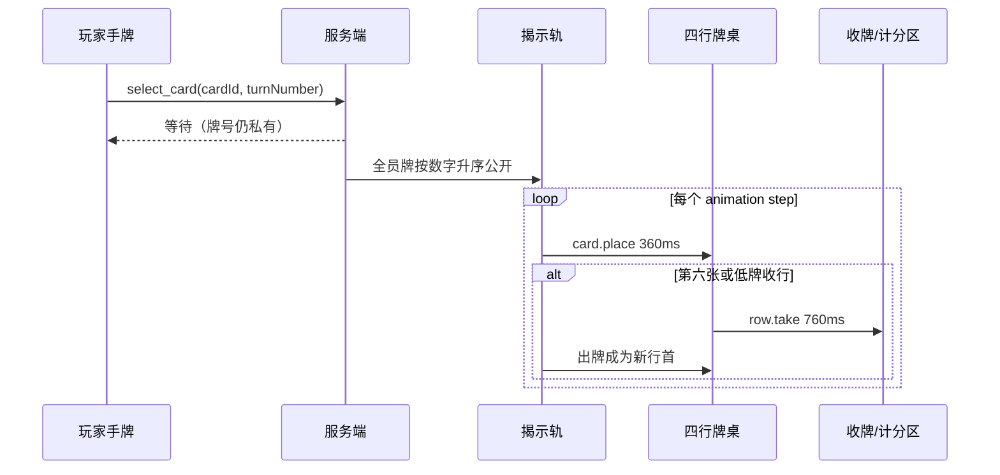

# 出牌与收牌动画模型

## 1. 权威边界

动画只解释服务端结果。客户端不能在响应前猜测目标行、收牌人或牛头分，也不能在动画结束回调中推进服务端状态。

服务端每次公开结算提供：

```json
{
  "id": 12,
  "kind": "turn_resolution",
  "roundNumber": 2,
  "turnNumber": 4,
  "revealed": [{ "playerId": "p2", "card": { "number": 30 } }],
  "steps": [{
    "id": "animation-12-30-0",
    "type": "take_full",
    "playerId": "p2",
    "rowIndex": 0,
    "card": { "number": 30, "bullheads": 3 },
    "takenCards": [
      { "number": 12, "bullheads": 1 },
      { "number": 14, "bullheads": 1 },
      { "number": 15, "bullheads": 2 },
      { "number": 21, "bullheads": 1 },
      { "number": 26, "bullheads": 1 }
    ],
    "penalty": 6
  }]
}
```

完整字段契约见 `model/animation-timeline.json`。

## 2. 时间线



## 3. 出牌动画

### 3.1 本地锁定 `card.commit`

- 180ms 抬起与缩小，表示请求已发送；
- 请求失败则回到手牌，不隐藏错误；
- 请求成功后牌移入“已锁定”槽，只对本人显示正面；
- 其他玩家只看到席位上的锁定标记。

### 3.2 同时揭示 `cards.reveal`

- 所有牌同时进入揭示轨，按升序排好；
- 每张 420ms 翻面，相邻错峰 90ms；
- 视觉错峰不改变逻辑顺序；
- 屏幕阅读器一次播报完整升序列表，避免逐帧刷屏。

### 3.3 正常落位 `card.place`

- 360ms 二次贝塞尔式弧线，从揭示轨到目标行尾；
- 多张牌按步骤间隔 120ms；
- 目标行使用金色边线，落定后立即恢复；
- 牌桌 DOM 已是最终快照，飞行牌是 `aria-hidden` 的表现副本；
- 起点和终点在权威快照渲染后由真实 DOM 几何测量，不使用固定像素猜测目标槽位；
- 窄屏上揭示轨允许局部横向滚动；若某张公开牌在滚动视口外，其表现副本从揭示轨最近的可视边缘出现，绝不从组件外穿入。

## 4. 收牌动画

### 4.1 第六张 `row.take-full`

1. 0–180ms：目标行红色脉冲并显示“第六张”；
2. 180–360ms：原五张压缩成一叠；
3. 360–650ms：牌叠沿弧线飞向收牌玩家的计分筹码；
4. 650–760ms：筹码数字跳变，出牌落为新行首。

收牌牌叠位于组件级独立运动层，层级高于牌桌、低于规则弹层。起点取触发行的真实卡槽中心，终点取收牌玩家的真实计分席；若该席位在横向玩家轨外，先仅滚动玩家轨使目标可见，再计算轨迹。这样牌叠不会被行容器裁切，也不会从桌面材质下方穿过。

### 4.2 低牌 `row.take-low`

玩家选择前不播放预测动画。服务端确认后：

1. 所选行出现明确描边；
2. 整行压缩并飞向该玩家；
3. 低牌从中央落到原行第一格；
4. 继续播放同一手余下的升序步骤。

## 5. 重连与去重

- `animation.id` 是单调事件号；组件持续挂载时，相同 ID 的快照更新不会重复创建动画节点。
- 初次挂载或重连时直接显示最新权威牌桌，不排队追播期间错过的历史事件；短暂表现层即使再次出现，也不能触发规则动作。
- 组件卸载时清除表现计时器；不写全局 class，不锁 `body` 滚动。
- 即使动画被后台标签页节流，服务端状态也不会停住。

## 6. 减弱动态与无障碍

`prefers-reduced-motion: reduce` 时：

- 关闭翻转、位移、缩放、抖动和错峰；
- 使用不超过 120ms 的透明度切换；
- 仍显示“谁把哪张牌放到哪一行、收了多少分”的文本事件；
- 警示不只依赖红色，同时使用“收牌”标签和牛角图标。

键盘焦点始终停在真实操作按钮，不跟随飞行副本移动。

## 7. 防穿模约束

1. 稳定牌桌、行槽和计分席不参与位移动画，避免布局重排。
2. 出牌副本与收牌牌叠只在 `pointer-events: none` 的表现层移动。
3. 运动起终点必须来自同一帧的真实布局坐标，并保持在游戏组件边界内；滚动视口外的揭示牌起点钳制到轨道可视边缘。
4. 收牌最多表现五张实体副本，与基础规则的一行上限一致。
5. 规则弹层层级始终高于运动层；按钮、手牌和行选择不会被透明动画元素阻挡。
6. 自动测试在 4–8 人、桌面和窄屏下采样运动矩形，检查越界、裁切和错误层级。
