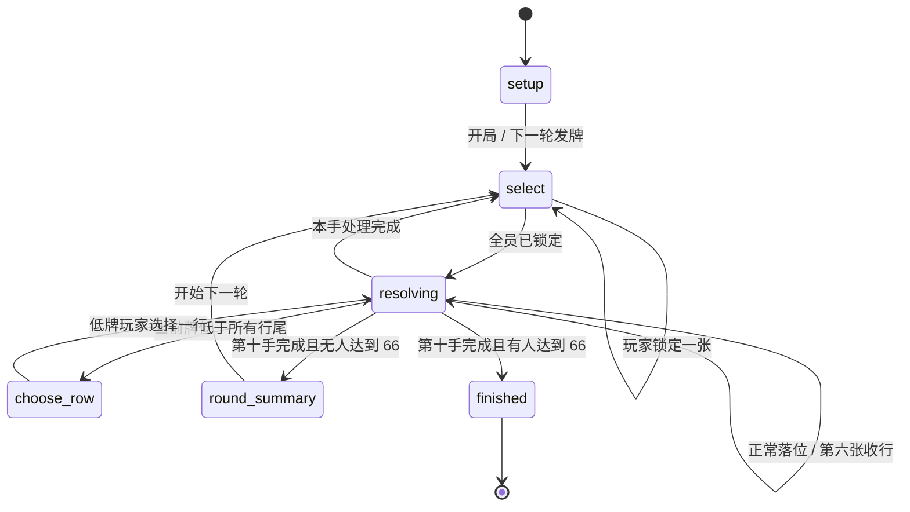

# 《谁是牛头王》插件设计方案

## 1. 产品目标

把实体桌游最重要的三种张力保留下来：同时选择时的信息不确定、公开后逐张改变行尾的连锁风险，以及“低牌自选”带来的主动止损。数字版不替玩家预测结果，也不提供最优行提示。

成功标准：

1. 2–10 人都能完成多轮牌局；
2. 手牌与暗选牌在揭示前绝不泄漏；
3. 四行判定完全由服务端执行；
4. 结算动画解释结果，但不会成为推进规则的时钟；
5. 320px 到桌面宽屏均无页面级横向滚动；
6. 动效关闭后仍能从文本、数字与图标理解牌局。

## 2. 权威状态机

机器版本见 `model/state-machine.json`。

## 3. 核心领域对象

| 对象 | 关键字段 | 责任 |
| --- | --- | --- |
| `NumberCard` | `number`、派生 `id/bullheads/tier` | 单张牌的唯一规则身份 |
| `BullheadKingState` | `hands/rows/captured/scores/stage` | 一局完整服务端真值 |
| `PendingPlay` | `player_id/card` | 已公开、尚待按升序处理的牌 |
| `animation` | `id/revealed/steps` | 客户端表现事件，不参与规则判断 |
| `round_summary` | `penalties/totals/leaderIds` | 一轮结束的稳定阅读快照 |

## 4. 动作契约

| 动作 | 阶段 | Payload | 服务端校验 |
| --- | --- | --- | --- |
| `select_card` | `select` | `{ cardId, turnNumber }` | 本人手牌、未锁定、轮次仍有效 |
| `take_row` | `choose_row` | `{ rowIndex, turnNumber }` | 仅低牌所有者、0–3 行号 |
| `next_round` | `round_summary` | `{ roundNumber }` | 仍在局、轮次仍有效 |
| `resign` | 任意进行阶段 | `{}` | 本局成员、尚未弃权 |

客户端永远不提交目标行用于正常落位，也不提交牛头分。服务端从当前四个行尾重新计算唯一合法行。

## 5. 信息可见性

| 信息 | 本人 | 其他玩家 |
| --- | --- | --- |
| 本人剩余手牌牌面 | 可见 | 隐藏 |
| 已锁定牌牌面 | 仅锁定者可见 | 隐藏 |
| 谁已锁定 | 可见 | 可见 |
| 同时揭示后的牌 | 可见 | 可见 |
| 四行牌面 | 可见 | 可见 |
| 收牌明细 | 服务端保存；界面只显示计数/分值 | 计数/分值 |
| 动画步骤 | 公共 | 公共 |

`view()` 只返回观看者本人的 `hand` 和 `committedCard`。其他玩家的手牌只投影为 `handCount`。由于宿主当前使用目标玩家完整快照实现观战，manifest 明确关闭 `spectators`；未来只有宿主提供独立公共投影入口后才应开启。

## 6. 不变量

1. 一轮使用的所有牌号唯一，范围为 1–104。
2. 开局每名有效玩家恰好 10 张，四行各 1 张。
3. 未全员锁定前，公开视图没有任何他人暗选牌号。
4. 每手公开牌按严格升序处理。
5. 正常落位目标是所有较小行尾中的最大者。
6. 一行在稳定状态下始终为 1–5 张且严格递增。
7. 第六张触发时只收原来的 5 张，出牌成为新行首。
8. 低牌收走所选整行，之后继续处理同手余牌。
9. 收走的牌永不返回手牌。
10. 只有完成一轮后才检查 66 分终局。
11. 最低总分可有多名共同胜者。
12. 游戏结束后不接受规则动作。

## 7. 牌桌布局

- 游戏根画布采用 `browser-fill` 沉浸布局，在宿主保留退出和房间控制后覆盖剩余浏览器可用区域；桌面端目标高度为 `max(760px, 100dvh - 112px)`。
- 顶部：可横向滚动的 2–10 人计分轨；每席显示锁定状态、本轮/累计牛头分和手牌数。
- 中央上方：本手揭示轨，按升序排列，动画使用同一顺序。
- 中央：四条行槽；桌面端横向展示最多五张，窄屏缩放卡宽而不隐藏牌号。
- 底部：仅本人可见的手牌安全区，可在容器内横向滚动。
- 右上：规则入口；详细历史作为次级信息，避免挤占牌桌。

场景比例与区域关系见 `assets/table-scene-blueprint.svg`。

## 8. 失败与恢复

- 重复提交：本地 `busy` 锁加服务端阶段/轮次双重校验。
- 断线：快照恢复，动画按 `animation.id` 去重，不追播。
- 中途退出：从有效玩家集合移除；已进入低牌选择时自动选择最低代价行。
- 资源失败：卡牌由 CSS 渲染，概念图和大厅图加载失败不影响玩法。
- 减弱动态：所有位移、翻转、抖动和错峰均替换为短淡入。

## 9. 非目标

不实现官方美术复刻、变体混玩、牌局预测器、提示 AI、可撤回暗选、客户端规则推演或对手手牌记牌工具。
