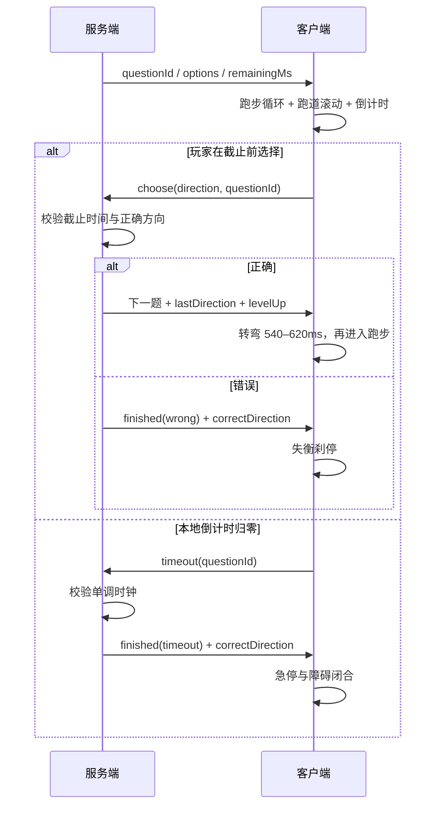

# 《算途疾行》动画与时序模型

> 跑步、接近路口、转弯、反馈与重连规则 v1.0

## 1. 权威边界

动画是服务端状态的表现层，不是计时或判题来源。

- 服务端生成题目、唯一正确方向和单调时钟截止点。
- 客户端显示本地平滑倒计时，并在归零时发送带题目 ID 的 `timeout` 动作。
- 任意 `choose` 到达服务端时若已越过截止点，服务端直接按超时结算。
- 客户端只有收到答对快照后才播放转弯；错答不能先播放成功路线。
- 重连直接显示当前快照，不补播错过的跑步或转弯动画。

## 2. 单题时间轴



## 3. 速度模型

每一级的速度由同一组参数驱动：服务端答题时限、跑道纹理周期、角色步频和速度线数量。视觉速度不改变服务端截止时间。

| 等级 | 时限 | 跑道周期 | 跑步周期 | 速度线 |
| ---: | ---: | ---: | ---: | ---: |
| 1 | 6500 ms | 1500 ms | 720 ms | 4 |
| 2 | 6100 ms | 1390 ms | 685 ms | 5 |
| 3 | 5700 ms | 1280 ms | 650 ms | 5 |
| 4 | 5300 ms | 1170 ms | 615 ms | 6 |
| 5 | 4900 ms | 1060 ms | 580 ms | 7 |
| 6 | 4500 ms | 950 ms | 545 ms | 8 |
| 7 | 4150 ms | 860 ms | 515 ms | 9 |
| 8 | 3800 ms | 780 ms | 485 ms | 10 |
| 9 | 3500 ms | 710 ms | 455 ms | 11 |
| 10 | 3200 ms | 650 ms | 430 ms | 12 |

## 4. 动画片段

| 名称 | 时长 | 触发 | 可中断 | 结束状态 |
| --- | ---: | --- | --- | --- |
| `track-scroll` | 循环 | `playing` | 是 | 当前相位 |
| `runner-cycle` | 循环 | `playing` | 是 | 当前相位 |
| `choice-commit` | 120 ms | 本地提交 | 否 | 等待快照 |
| `turn-left/right` | 620 ms | 服务端答对 | 是，重连 | `running` |
| `turn-up/down` | 540 ms | 服务端答对 | 是，重连 | `running` |
| `correct-ripple` | 460 ms | 服务端答对 | 是 | 透明 |
| `level-pulse` | 900 ms | 每连续答对 10 题 | 是 | 透明 |
| `wrong-stumble` | 540 ms | 错答结算 | 否 | 静止 |
| `timeout-brake` | 480 ms | 超时结算 | 否 | 静止 |
| `finish-run` | 1100 ms | 第 100 题答对 | 否 | 终点姿态 |

## 5. 输入锁

- 第一次有效方向输入后立刻进入 `submitting`，在请求完成前忽略其他键和点击。
- 键盘自动重复 (`event.repeat`) 不产生多次动作。
- 输入目标是表单控件时不拦截 WASD。
- 服务端返回 `false` 或请求失败时解除本地锁；若题目 ID 已变化，则以新快照为准。
- `timeout` 与 `choose` 竞争时由题目 ID 和服务端时钟裁决；过期的 `timeout` 可安全忽略。

## 6. 倒计时动画

客户端收到快照时记录：

```text
localDeadline = performance.now() + remainingMs
displayRemaining = max(0, localDeadline - performance.now())
```

进度环使用 `displayRemaining / timeLimitMs`。网络往返期间不人为回拨倒计时；收到新题后重新锚定。

最后 25% 时：

- 数值切换为警示材质；
- 进度环边缘进行低频呼吸；
- 不改变题牌位置或算式字号；
- 不播放声音，避免插件擅自控制宿主音频。

## 7. 失败与通关

- 错答：所选题牌显示叉形图案，正确题牌显示勾形图案，角色失衡但不坠落。
- 超时：障碍在安全距离闭合，正确题牌显示勾形图案，角色急停。
- 通关：跑道延伸至终点平台，角色冲线；结果卡在动画 400 ms 后淡入，但重连时立即显示。

## 8. 减弱动态效果

当 `prefers-reduced-motion: reduce`：

- 关闭 `track-scroll`、`runner-cycle`、速度线、云层漂移和循环呼吸。
- 转弯、答对、升级、失败使用 `120–180 ms` 透明度切换。
- 倒计时仍按数字与静态进度条更新。
- 输入锁、服务端截止点和结算逻辑完全不变。

## 9. 测试点

1. 同一题连续按键只发出一次 `choose`。
2. 按下不可用方向不提交动作。
3. 本地倒计时归零只发送一次 `timeout`。
4. 新题到达后旧 `timeout` 不会结束新题。
5. 服务端确认前不出现正确转弯反馈。
6. 等级变化同时更新时限、步频、跑道周期和速度线数量。
7. 组件卸载后无残留计时器、动画帧或键盘监听。
