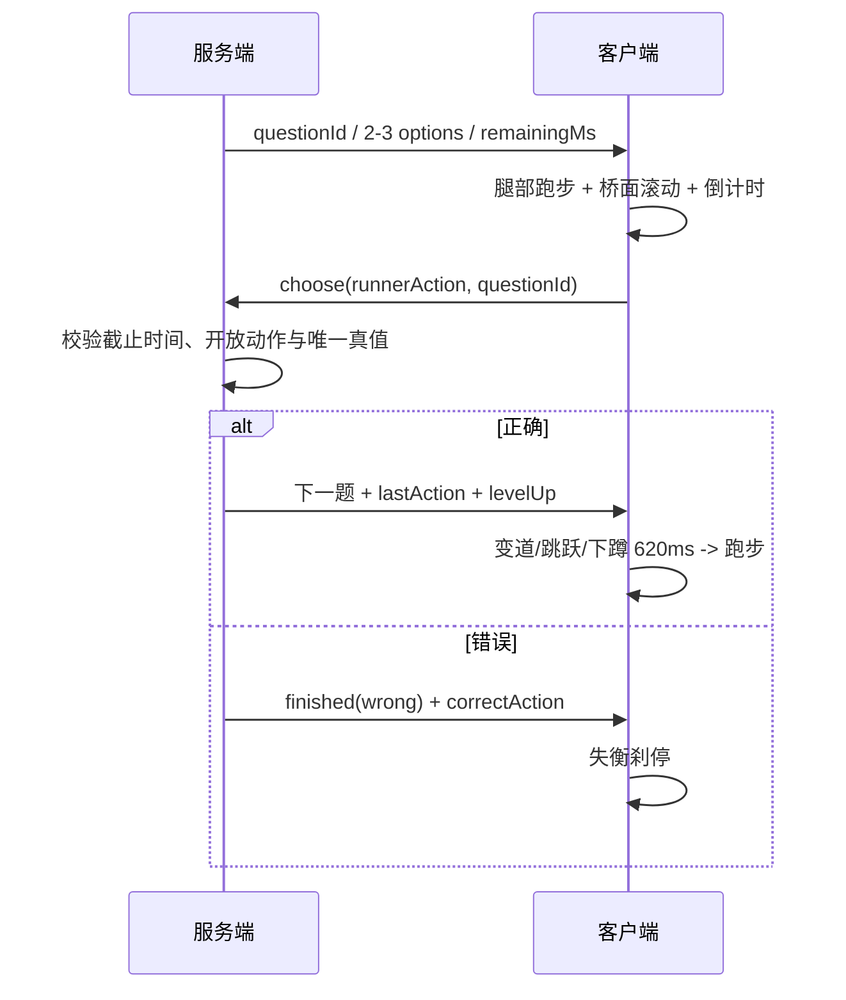

# 《算途疾行》动画与时序模型

> 跑步、桥面接近、变道、跳跃、下蹲、反馈与重连规则 v2.0

## 1. 权威边界

- 服务端生成 2/3 跑道、唯一正确动作和单调时钟截止点。
- 客户端显示本地平滑倒计时，并在归零时发送当前 `questionId` 的 `timeout`。
- `choose` 到达服务端时若已越过截止点，直接按超时结算。
- 客户端只有收到下一题与 `lastAction` 后才播放成功动作。
- 重连直接显示当前快照，不补播已错过的动作。

## 2. 单题时间轴



## 3. 速度参数

| 等级 | 时限 | 桥面周期 | 跑步周期 | 速度线 |
| ---: | ---: | ---: | ---: | ---: |
| 1 | 6500 ms | 1500 ms | 720 ms | 4 |
| 2 | 6100 ms | 1390 ms | 685 ms | 5 |
| 3 | 5700 ms | 1280 ms | 650 ms | 5 |
| 4 | 5300 ms | 1170 ms | 615 ms | 6 |
| 5 | 4900 ms | 1060 ms | 580 ms | 7 |
| 6 | 4500 ms | 950 ms | 545 ms | 8 |
| 7 | 4150 ms | 860 ms | 515 ms | 9 |
| 8 | 3800 ms | 780 ms | 485 ms | 10 |
| 9 | 3500 ms | 710 ms | 455 ms | 11 |
| 10 | 3200 ms | 650 ms | 430 ms | 12 |

视觉速度不改变服务端截止时间。

## 4. 动画片段

| 名称 | 时长 | 触发 | 表现 |
| --- | ---: | --- | --- |
| `bridge-scroll` | 循环 | `playing` | 桥面接缝向后移动 |
| `runner-cycle` | 循环 | `playing` | 双臂双腿交替摆动 |
| `left/right` | 620 ms | 服务端答对 | 横移与倾斜 |
| `jump` | 620 ms | 服务端答对 | 腾空、收腿、落地 |
| `slide` | 620 ms | 服务端答对 | 压低、前倾、滑行 |
| `level-pulse` | 900 ms | 每 10 题 | 等级提示 |
| `wrong-stumble` | 540 ms | 错答 | 失衡刹停 |
| `timeout-brake` | 480 ms | 超时 | 障碍前急停 |
| `finish-run` | 1100 ms | 第 100 题 | 冲向终点 |

## 5. 输入锁与键盘

- W/↑/空格映射 `jump`。
- A/← 映射 `left`。
- S/↓ 映射 `slide`。
- D/→ 映射 `right`。
- 第一次有效输入后进入 `submitting`，请求完成前忽略重复输入。
- `event.repeat`、Ctrl/Alt/Meta 组合键和表单输入不触发跑酷。
- 当前题段未开放的动作不提交。
- 旧 `timeout` 不能结束新题。

## 6. 倒计时

```text
localDeadline = performance.now() + remainingMs
displayRemaining = max(0, localDeadline - performance.now())
```

最后 25% 时只改变进度环和警示材质，不移动题牌或改变算式字号。

## 7. 返回与卸载

插件不锁定 `html` / `body`，不使用普通态全屏固定定位。宿主返回按钮保持可见。组件卸载时必须：

- 停止倒计时；
- 清除动作反馈定时器；
- 移除键盘监听；
- 不留下全局 class 或滚动状态。

## 8. 减弱动态

`prefers-reduced-motion: reduce` 时关闭桥面滚动、速度线和无限跑步循环；四个动作改为静态位移/姿态。输入锁、倒计时和服务端结算保持不变。
