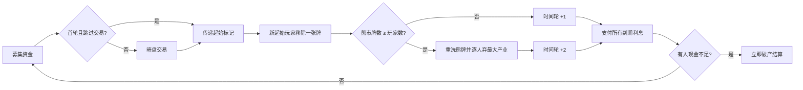

# 庞氏骗局插件设计书

## 1. 设计目标

把这款游戏最重要的张力——“公开、不断变大的负债”与“挡板后无法确认的现金”——保留在数字桌面上。系统不替玩家计算安全策略，也不显示对手现金区间；它只负责执行不可争议的规则和隐私隔离。

视觉上使用原创的 1920 年代账房语言：瓶绿桌毡、炭灰海军蓝、旧象牙纸、哑光黄铜和少量牛血红。附图只提供材质尺度参考，不参与图案、人物、标志或版式复制。

## 2. 组件模型

### 2.1 资金／贷款牌

`data/components.json` 是唯一数据源。每张牌包含：

| 字段 | 含义 |
|---|---|
| `id` | 唯一编号 `F009`–`F080` |
| `amount` | 取得时一次性到账的现金 |
| `period` | 每次利息之间的轮数，3–5 |
| `interest` | 每次到期必须支付的现金 |
| `averageBurden` | `interest / period` 的四舍五入展示值 |
| `yieldPercent` | 名义压力提示值，仅展示，不参与规则 |
| `kind` | `starting`、`regular` 或 `bear` |

牌的金额、周期、利息和当前位置都公开。卡面不使用人物照片，以大号金额、利息与周期组成信息层级。`images/fund-card-atlas.svg` 展开全部 72 张卡，可直接逐张核对。

### 2.2 现金

现金是整数，银行不设上限。前端用 1、5、10、20 面额纸钞堆表现自己的余额；对手只显示封闭挡板。服务端绝不向非本人视图发送进行中的现金数值，因此不能通过 DOM 或网络快照偷看。

### 2.3 产业与奢侈品

四种产业各 15 枚，使用不同颜色和抽象字形。募集阶段数量上限为 3，暗盘交易没有这个上限。奢侈品是全局唯一物，购买替代当轮暗盘动作；价格和分数同时公开。

### 2.4 时间轮

服务端把每张持有牌建模为 `{card_id, due_in}`。正常结算将 `due_in` 减 1，崩盘减 2；小于等于 0 的牌本轮到期并重置为原周期。由于最短周期为 3，一次双格推进不会让同一张牌在同轮到期两次。

前端以固定箭头与五个位置绘制个人时间轮，同时在公开账簿中显示每张负债还有几轮到期。

### 2.5 玩家与挡板

玩家公开账簿包括产业堆、资金牌、下轮公开利息、循环总利息与奢侈品。个人桌面另有现金托盘和时间轮。挡板既是视觉组件，也是权限边界的直接提示。

## 3. 权威状态机

可变状态集中在 `PonziSchemeState`：牌库、市场、弃牌、产业供应、奢侈品市场、各玩家账簿、待回应交易、崩盘队列、轮次和事件带。所有动作先校验阶段、当前玩家和服务端给出的合法范围。

## 4. 暗盘交易模型

待回应交易只存一份权威对象：发起人、目标、产业和价格。

- 公共视图可见参与者与产业，但 `offer = null`。
- 发起人和目标的视图可见准确价格。
- “收下”由发起人付款，产业从目标转给发起人。
- “反向”由目标支付同额现金，产业从发起人转给目标。
- 公共事件日志从不记录金额，交易完成后服务器不再广播价格。

建模图 `images/clandestine-trade-process.png` 用三段式画面表达“装信封—私下查看—卖出／反向买入”；`images/component-blueprint.svg` 则给出可核验的状态机工程图。

## 5. 崩盘与破产

市场移除牌并补满后检查阈值。崩盘时先拿走所有可见熊市牌，再把它们与牌库、弃牌混洗；非熊市市场牌保持原位。弃产业按新起始玩家开始的顺序处理，零产业玩家自动跳过。

付息按同一轮快照计算。能支付者扣款；现金小于应付利息者同时标为破产，随后立刻终局。退出或断线超时也按单人破产处理，避免桌局永久卡住。

## 6. 计分与可审计性

产业分逐类使用三角数，不先合并产业。默认把奢侈品分加入产业分；兼容选项则改用旧版财富分。破产玩家没有终局分。排名先比较总分，再比较持有的最高金额资金牌，最后仅用座次稳定显示；若前两项仍完全相同则并列获胜。

终局时现金解除隐藏，便于所有玩家核对结算。`record_state()` 使用无身份公共视图，进行中的现金和暗盘金额不会进入录像或战绩快照。

## 7. 前端场景

桌面从上到下分为：状态抬头、中央募集板／行动夹、产业和奢侈品供应、个人挡板区、终局审计、公开玩家账簿和事件纸带。插件使用 `immersive` 房间布局，游戏主体宽度铺满宿主舞台，最小高度为浏览器可视区扣除顶部控制区；退出、设置等宿主按钮仍保留在游戏画面上方。宽屏保持市场与行动并排并放大行动夹；窄屏把行动夹移到市场下方，三张卡仍保持同排，个人组件改为单列。

状态不仅靠颜色表达：熊市显示计数，资金牌显示文字类型，到期牌有描边，破产有文字印章。服务端事件驱动一条顺序动画队列，覆盖资金牌入账、信封递交与反向流转、奢侈品、市场移牌、崩盘、产业退回、现金付息、轮盘、破产和起始标记。动画层被限制在桌面容器内并使用独立 `cue-*` 命名空间，避免与物件样式相撞；动画遵守 `prefers-reduced-motion`。

## 8. 建模图清单

- `images/fund-card-atlas.svg`：72 张牌的精确矢量全集。
- `images/component-blueprint.svg`：市场、轮盘、纸钞、产业、奢侈品与暗盘状态机。
- `images/component-concept.png`：组件材质与色彩概念板。
- `images/clandestine-trade-process.png`：暗盘交易三段流程。
- `images/table-scene-concept.png`：五人完整桌游场景。
- `frontend/assets/catalog-dark.webp` 与 `catalog-light.webp`：商店目录图标，768×768、不透明、同构图。

## 9. 验证策略

后端测试覆盖 3–5 人完整自动对局、组件守恒、初始市场、三排限制、现金隐私、暗盘双方视图、0 元和无效报价、接受／反向报价、熊市阈值与重洗、双格时间轮、并列最大产业、精确付清、累计付息、单人／多人／全员破产、退出、计分、最高资金牌决胜与并列胜者。前端测试逐项覆盖 11 类事件动画、动画队列、固定到期箭头、终局分项和减弱动态设置。模型脚本检查 JSON Schema、卡牌 ID 连续性、类别数量和图片规格。

专用浏览器回归台位于 `tests/live_browser_harness/`。它提供 3 人募集、4 人暗盘、5 人崩盘和 5 人终局四种可切换场景，以及每一类动画的触发按钮。2026-09-02 的本地回归在 1440×1000 与 390×844 两种视口执行：桌面宽度覆盖可用浏览器舞台、九张卡没有互相重叠、四种场景均无横向溢出，11 类动画中点均在桌面边界内，浏览器控制台无错误或警告。完整矩阵见 `docs/TEST-MATRIX.md`。
