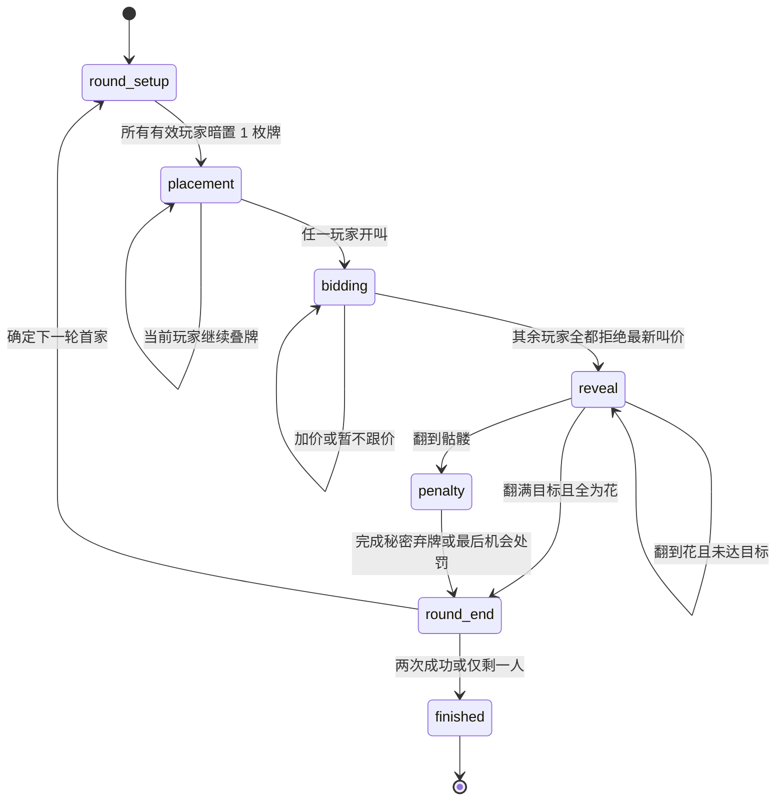

# 《骷髅牌》卡牌与场景建模

> 面向 `game-hall` 插件实现的领域模型与交互规格 v1.0

## 1. 建模目标

本模型把实体桌游拆成三层：

1. **权威规则层**：服务端保存完整牌面、位置、竞标、处罚与胜负真值。
2. **安全视图层**：按观看者投影可见信息，所有未知牌统一变成 `unknown`。
3. **交互场景层**：前端依据阶段、合法动作和视图状态呈现桌面，不自行推导规则结果。

开局第一轮首家由服务端随机抽取；后续轮次和竞价中的顺时针顺序保持现有规则不变。

模型只描述规则和交互，不复制官方视觉。`assets/` 中的图形是原创中性占位资产。

## 2. 状态机



数字实现可以把 `round_setup` 和“所有玩家初始暗置”合并为一个并发提交场景，但服务端状态仍要区分“尚未全部提交”和“已进入轮流行动”。

## 3. 领域对象

| 对象 | 关键字段 | 责任 |
| --- | --- | --- |
| `GameState` | `phase`、`rules`、`players`、`roundState`、`result` | 一局游戏的完整服务端真值 |
| `PlayerState` | `status`、`challengeWins`、`hand`、`stack`、`removed` | 玩家牌区、积分、竞标状态与淘汰状态 |
| `Disc` | `id`、`kind`、`origin`、`faceUp` | 一枚花、骷髅或最后机会牌 |
| `RoundState` | 首家、当前行动者、总牌数、竞标、挑战、最后机会期限 | 当前轮次的所有短期状态 |
| `BidState` | 当前叫价、最高叫价者、已拒绝当前叫价的玩家 | 竞标推进与合法性判断 |
| `ChallengeState` | 挑战者、目标、翻牌序列、失败牌、待处罚 | 挑战逐步结算 |
| `ViewState` | `viewer`、脱敏后的玩家与牌、合法动作 | 单一客户端允许看到的快照 |

### 3.1 圆牌类型

| `kind` | 来源 | 公共知识 | 规则作用 |
| --- | --- | --- | --- |
| `flower` | 每名玩家 3 枚 | 暗置时只对所有者可见，翻开后公开 | 安全牌，计入成功数量 |
| `skull` | 每名玩家 1 枚 | 暗置时只对所有者可见，翻开后公开 | 挑战立即失败 |
| `last_chance_flower` | 公共供应区唯一 1 枚 | 始终公开知道是花 | 只在获得后的下一轮临时使用 |

### 3.2 牌区

- `hand`：玩家尚未放置的牌；必须面朝下，只有所有者知道个人牌种类。
- `stack`：玩家垫上的牌堆，数组按 **底部到顶部** 排列；最后一项是当前可翻牌。
- `removed`：永久移除的个人牌；其种类仍只对原所有者可见。
- `sharedDiscs`：未被持有的最后机会牌等公共供应物。

一个牌 ID 在整个权威状态中必须且只能出现一次。

## 4. 回合动作契约

建议插件动作采用下列名称和 payload。所有动作都必须由服务端根据阶段、当前行动者、牌区和规则重新验证。

| 动作 | 阶段 | Payload | 服务端效果 |
| --- | --- | --- | --- |
| `commit_initial` | `round_setup` | `{ "discId": "p1-f1" }` | 锁定本轮初始暗置；所有人完成后同时进入各自牌堆 |
| `place_disc` | `placement` | `{ "discId": "p1-s1" }` | 把自己手牌移到自己牌堆顶部，并轮转行动者 |
| `open_bid` | `placement` | `{ "count": 2 }` | 校验范围后进入 `bidding`，行动移交下一名有效玩家 |
| `raise_bid` | `bidding` | `{ "count": 4 }` | 严格提高叫价、更新最高叫价者，并清空此前所有暂不跟价标记 |
| `pass_bid` | `bidding` | `{}` | 只拒绝当前最高叫价；其余玩家全部拒绝该叫价时进入挑战 |
| `reveal_disc` | `reveal` | `{ "ownerId": "p3" }` | 服务端翻开目标牌堆顶部的合法暗牌；客户端不传牌 ID |
| `choose_penalty` | `penalty` | `{ "slotId": "opaque-2" }` | 在服务端映射的洗混槽位中盲选一枚挑战者个人牌 |
| `choose_self_penalty` | `penalty` | `{ "discId": "p1-f2" }` | 仅翻到自己骷髅时，由挑战者秘密选择自己的牌 |
| `choose_next_first` | `round_end` | `{ "playerId": "p2" }` | 仅自我淘汰时，由被淘汰挑战者指定仍在场首家 |
| `show_unrevealed` | `round_end` | `{ "discIds": ["p2-s1"] }` | 可选社交展示；不得改变处罚、积分或首家 |

### 4.1 为什么 `reveal_disc` 不接受牌 ID

挑战者只应该选择“翻哪个玩家的顶部牌”，不应从网络请求中接触对手的隐藏牌 ID。服务端根据 `stack[-1]` 确定实际牌，并返回脱敏后的新快照。这同时避免客户端越过顶部牌和利用 ID 命名猜测牌面。

### 4.2 盲选处罚

翻到他人的骷髅后：

1. 服务端收集挑战者全部剩余 **个人牌**，不包含公共供应物。
2. 使用安全随机源打乱并生成一次性 `slotId`。
3. 骷髅所有者只收到槽位列表，不能收到牌 ID、原牌区、原堆叠位置或牌种。
4. 选择者提交一个 `slotId`；服务端解析到真实牌并永久移除。
5. 只有挑战者视图收到被移除牌种；其他视图只看到个人牌总数减少。

槽位映射必须放在服务端临时状态中，并在处罚完成后销毁，防止重放。

## 5. 核心不变量

以下约束不能只依靠界面禁用按钮：

1. 每名玩家开局恰好拥有 4 枚个人牌，其中 3 花、1 骷髅。
2. 个人牌只能在该玩家的 `hand`、`stack`、`removed` 三个区域之一。
3. `removed` 中的个人牌不会回到游戏；最后机会牌不进入个人永久弃牌统计。
4. 每名有效玩家在一轮进入 `placement` 前恰好有 1 枚牌在自己的 `stack`。
5. 牌堆按底到顶存储，正常翻牌只能选择最后一个仍面朝下的元素。
6. 叫价始终满足 `1 <= bid <= totalPlaced`；加价必须严格变大。
7. `pass_bid` 只在当前最高叫价不变时跳过该玩家；任意 `raise_bid` 都清空全部暂不跟价标记，使其他仍在场玩家重新获得一次回应机会。只有其他所有玩家都拒绝最新叫价，才进入挑战。
8. 挑战者需要继续翻别人牌时，自己的牌堆中不能仍有面朝下的牌。
9. 翻到骷髅立即冻结进一步翻牌并进入处罚；翻满目标立即成功，不多翻牌。
10. 每次成功只增加 1 次挑战胜利；达到 2 次立即结束整局。
11. 普通失败只移除挑战者 1 枚个人牌；最后机会生效轮的持有者失败时例外，直接同时失去临时牌和最后一枚个人牌。
12. 被淘汰玩家不参与后续初始暗置、行动轮转或叫价上限计算。
13. 未淘汰挑战者总是下一轮首家；仅在挑战者被淘汰时才切换到骷髅所有者或指定流程。
14. 一名玩家整局最多获得一次最后机会牌，且它只在指定的下一轮存在。
15. 游戏结束后，除公共再来一局流程外不接受任何规则动作。

`scripts/validate_models.py` 会对示例数据执行其中可静态验证的跨字段约束。

## 6. 隐藏信息与视图投影

### 6.1 可见性矩阵

| 信息 | 本人 | 其他玩家 | 公共观众 |
| --- | --- | --- | --- |
| 自己手牌种类 | 可见 | 隐藏 | 隐藏 |
| 自己暗置牌种类 | 可见，作为实体记忆替代 | 隐藏 | 隐藏 |
| 已翻开的任意牌 | 可见 | 可见 | 可见 |
| 最后机会牌的种类 | 可见 | 可见 | 可见 |
| 秘密弃掉的个人牌 | 仅原所有者可见 | 隐藏 | 隐藏 |
| 当前叫价和暂不跟价者 | 可见 | 可见 | 可见 |
| 处罚槽位到牌面的映射 | 服务端内部 | 服务端内部 | 服务端内部 |
| 对局结束后的全部暗牌 | 默认仍隐藏 | 默认仍隐藏 | 默认仍隐藏 |

### 6.2 牌面投影

安全视图中的牌使用：

```json
{
  "id": "opaque-p2-stack-1",
  "kind": "unknown",
  "faceUp": false,
  "knowledge": "hidden"
}
```

只有以下情况可以输出真实 `kind`：

- 该牌已翻开，`knowledge = "public"`；
- 该牌属于当前玩家，`knowledge = "self"`；
- 它是最后机会牌，`knowledge = "public"`。

公共观众视图不得借用任何玩家私有视角。若宿主只能提供固定玩家视角观战，插件应明确选择“纯公共投影”，避免把目标玩家的手牌泄漏给观众。

### 6.3 ID 脱敏

不要把内部 ID 命名成 `p2-skull` 后再仅隐藏 `kind`。安全视图应使用随机或位置型不透明 ID，并在牌移动后按需要重新映射，避免通过日志、DOM 属性或网络差分猜出牌面。

## 7. 交互场景目录

机器可读目录见 `model/scene-catalog.json`。建议前端至少实现以下九个场景：

| 场景 ID | 核心画面 | 主要动作 |
| --- | --- | --- |
| `setup.table` | 座位、玩家垫、规则摘要 | 房主开局 |
| `round.commit` | 自己手牌与暗置槽 | 选择并锁定初始牌 |
| `round.place-or-bid` | 各牌堆数量、自己的剩余手牌 | 叠牌或开叫 |
| `bid.raise-or-pass` | 中央叫价盘、当前最高者、本价暂不跟标记 | 加价或暂不跟价 |
| `challenge.reveal-own` | 挑战者自己的牌堆高亮 | 翻自己的顶部牌 |
| `challenge.reveal-others` | 合法对手牌堆高亮 | 选择一个玩家并翻顶部 |
| `penalty.blind-pick` | 不透明处罚槽位 | 骷髅所有者盲选 |
| `round.summary` | 本轮成功/失败、积分、下一任首家 | 查看并继续 |
| `game.finished` | 胜者、胜因、剩余牌数量 | 再来一局 |

## 8. 桌面场景建模

### 8.1 桌面端

- 采用略俯视圆桌或六边形桌面，最多六个座位围绕中央叫价盘。
- 当前玩家固定在画面底部，其他玩家按相对座次顺时针排列，避免重连后座位跳动。
- 每个座位包含：昵称、在线状态、成功次数、玩家垫、叠牌数量、是否暂不跟进当前叫价、本轮最后机会标记。
- 牌堆使用 6-10 px 错位展示层数；只允许最上方合法牌出现交互光圈。
- 中央叫价盘同时显示 `当前叫价 / 桌面总牌数`，并显示最高叫价者。
- 自己手牌放在底部安全区，牌面可见；他人手牌只显示数量。

### 8.2 移动端

- 自己区域固定在底部，手牌横向排布，不产生页面级横向滚动。
- 对手区域压缩为顶部横向座位带；点击座位可展开牌堆，但不能改变相对顺序。
- 中央区域优先保留叫价、阶段和合法目标，聊天与详细历史放入抽屉。
- 主要按钮放在拇指可达区：叠牌、开叫、加价、暂不跟价不能依赖悬停。
- 翻牌采用明确的二次确认或短按后动画锁定，避免移动端误触连续翻牌。

### 8.3 动画与时序

- 动画只是服务端状态变化的表现；断线重连可直接跳到最终姿态。
- 翻牌动画完成前可以临时锁住本地输入，但服务端仍以阶段和 revision 防重入。
- 骷髅出现时立即停止后续翻牌队列；不要预先播放客户端推测的多张翻牌动画。
- 处罚槽位洗混动画结束后才开放选择，动画轨迹不得暴露真实映射。

### 8.4 无障碍

- 花与骷髅不能只靠红绿颜色区分；已公开牌同时提供图形、文字和读屏标签。
- 叫价变化通过 `aria-live="polite"` 播报；翻到骷髅和游戏结束使用更高优先级提示。
- 所有牌堆和处罚槽位可用键盘聚焦并操作。
- 减弱动态效果设置开启时，使用淡入与状态切换替代翻转、洗混和震动。
- 触控目标最小 44 x 44 CSS px，正文与牌数在 320 px 宽度仍可读。

## 9. 卡牌组件建模

### 9.1 几何

- 个人牌为圆形组件，推荐逻辑直径 `88`；点击区至少 `96 x 96`。
- 牌背在同一玩家套牌内完全一致，只通过玩家套牌色区分所有者。
- 花牌、骷髅牌在牌面层使用高对比图形；不能靠细小文字识别。
- 最后机会牌使用独立公共材质和持续可见的安全标记，使所有人知道它是花。

### 9.2 语义材质

`model/player-card-models.json` 提供六套原创牌背、花牌正面和骷髅牌正面模型，完整约束见 `docs/PLAYER_CARD_MODEL.md`。`model/card-catalog.json` 保留牌种语义与模型引用。实际插件应把颜色映射到宿主主题令牌：

- `surface`：牌面或玩家垫基础材质；
- `edge`：圆牌边缘与层叠轮廓；
- `accent`：座位识别色；
- `safe`：花牌已公开状态；
- `danger`：骷髅已公开状态；
- `focus`：当前合法目标，不得与危险色混用。

色彩只辅助识别，牌种、状态和动作必须有独立图标或文本。

## 10. 关键验收场景

至少覆盖以下自动化测试：

1. 三名玩家完成初始暗置前，任何人都不能读取别人的牌种。
2. 首家可以直接开叫 1；手牌为空的玩家不能执行叠牌。
3. 叫价为 0、超过桌面牌数或未高于当前叫价时拒绝。
4. 玩家暂不跟进叫价后先跳过；另一玩家加价时清空标记，前者再次进入顺时针行动并可继续加价。仅当其他所有玩家都暂不跟进最新叫价时进入翻牌；其牌堆始终可被挑战者选择。
5. 挑战者自己的牌堆还有暗牌时，翻别人牌被拒绝。
6. 不能选择某个牌堆的非顶部牌；客户端 payload 不携带目标牌 ID。
7. 翻到花且未达叫价时继续，翻满时只增加一次成功并停止。
8. 翻到骷髅后任何继续翻牌请求都被拒绝。
9. 他人骷髅处罚时，选择者看不到槽位对应牌种；挑战者能看到最终失去哪一枚。
10. 自己骷髅处罚时，只有挑战者能选择并看到被移除牌。
11. 未淘汰挑战者下一轮仍为首家；两种淘汰来源分别走正确首家逻辑。
12. 即使房间传入房主首家偏好，开局第一轮仍只由服务端随机抽取一次；第二轮不重新随机。
13. 每次翻牌都向所有视角投影相同的序号、牌堆所属者与花/骷髅结果；成功挑战的最后一张在进入下轮后仍可见。
14. 第二次挑战成功立即结束；只剩一名有效玩家也立即结束。
15. 最后机会牌只存在于获得后的下一轮，过期归还，每人最多获得一次。
16. 最后机会持有者在生效轮挑战失败时自动淘汰，不进入普通盲选。
17. 重连后的安全视图不包含他人手牌、暗置牌、秘密弃牌或处罚槽位映射。

## 11. 数据文件关系

```text
card-catalog.json
    定义牌种、数量、视觉语义与玩家模型引用

player-card-models.json
    定义六名玩家的牌背、花牌正面和骷髅牌正面
        -> assets/player-cards/generated/*.svg
        -> assets/player-cards/player-card-atlas.svg
        -> assets/player-cards/manifest.json

game-state.schema.json
    约束服务端完整真值
        -> examples/internal-*.json

view-state.schema.json
    约束脱敏客户端快照
        -> examples/*-view-*.json

scene-catalog.json
    定义前端阶段场景、进入条件、动作和布局重点
```

`game-state.schema.json` 负责规则状态结构，`player-card-model.schema.json` 负责视觉生成数据结构，`validate_models.py` 负责 JSON Schema 不擅长表达的跨数组计数、牌 ID 唯一性、花骷髅配比、桌面牌数、视图泄漏、生成资产数量和哈希一致性检查。

## 12. 非目标

- 本模型不包含可运行的后端引擎或 Vue 界面。
- 不定义商业发行用美术、印刷出血、官方部落图案或 Logo。
- 不增加 AI、计时赛、积分赛、全知观战或 6 人以上扩展规则。
- 不把聊天内容变成可验证的规则状态；玩家说真话或说谎都合法。

后续插件实现若修改任何核心规则，应先更新规则说明书、Schema、示例和验收场景，再同步代码。
