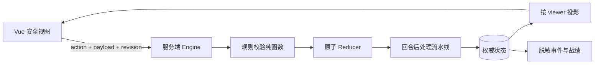
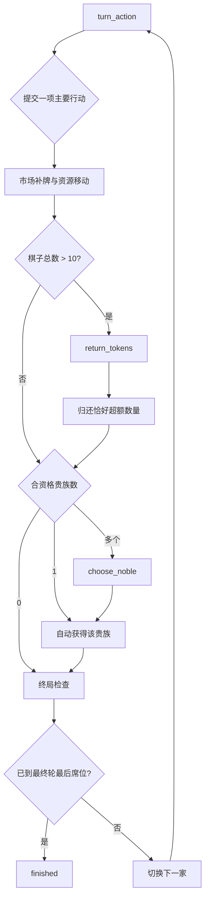

# 《璀璨宝石》Game Hall 实现方案

## 1. 目标与边界

目标是把 2024 十周年新版基础规则实现为一个服务端权威、可重连、可观战、可审计的 `game-hall` 插件。客户端只显示安全视图、组织交互并提交玩家意图；洗牌、可取棋子、费用、黄金分配、市场补牌、贵族、最终轮与赢家全部由服务端计算。

首个可发布版本应支持：

- 2-4 名真人玩家；
- 完整 90 张发展卡和 10 张贵族；
- 随机先手或房主先手，并绑定首位玩家标记；
- 市场保留、牌堆盲保留、精确黄金支付和 10 枚棋子上限；
- 最终轮、双层同分裁决与共同赢家；
- 断线重连、只读观战、战绩和再来一局；
- 桌面、平板和手机的响应式界面。

首版不包含扩展、《璀璨宝石：对决》、AI、提示引擎、撤销、异步长局、聊天或官方素材。

## 2. 推荐目录

```text
plugin-splendor/
├── manifest.json
├── README.md
├── backend/
│   ├── plugin.py                 # 固定无参数工厂
│   ├── engine.py                 # 生命周期、动作入口、视图投影
│   ├── state.py                  # TypedDict/dataclass 权威状态
│   ├── catalog.py                # 加载并索引模型目录
│   ├── rules.py                  # 合法行动、费用、贵族与终局纯函数
│   ├── reducer.py                # 原子区域移动和回合流水线
│   └── rng.py                    # 可注入、可复现的服务端随机源
├── model/
│   ├── card-catalog.json
│   ├── component-catalog.json
│   └── state-machine.json
├── frontend/
│   ├── GameView.vue
│   ├── types.ts
│   ├── composables/useSplendor.ts
│   ├── components/
│   │   ├── DevelopmentCard.vue
│   │   ├── NobleTile.vue
│   │   ├── MarketTier.vue
│   │   ├── GemSupply.vue
│   │   ├── PlayerTableau.vue
│   │   ├── ReservedCards.vue
│   │   ├── PaymentComposer.vue
│   │   ├── TokenReturnSheet.vue
│   │   ├── NobleChoiceSheet.vue
│   │   └── FinalRanking.vue
│   └── assets/
│       ├── catalog-dark.webp
│       └── catalog-light.webp
└── tests/
    ├── test_setup.py
    ├── test_actions.py
    ├── test_payment.py
    ├── test_nobles_and_endgame.py
    ├── test_views.py
    ├── test_full_game_simulation.py
    └── GameView.test.ts
```

本建模目录可作为输入，但正式插件应把经审核的模型复制进自己的目录，不能跨兄弟目录导入。

## 3. Manifest 建议

| 字段 | 建议值 |
| --- | --- |
| `id` | `plugin-splendor` |
| `name` | `璀璨宝石` |
| `players` | `min: 2, max: 4` |
| `roomLayout` | `immersive` |
| `capabilities.guests` | `true` |
| `capabilities.spectators` | `true` |
| `capabilities.spectatorFrames` | `false` |
| `capabilities.firstPlayer` | `true` |
| `capabilities.undoActions` | `[]`，保留和补牌会暴露新信息 |
| `capabilities.drawRequests` | `false` |
| `capabilities.replay` | 首版 `false`；有完整事件重演后再开启 |
| `capabilities.ai` | 首版 `false` |
| `records.scoreKind` | `outcome` |

推荐默认选项：

```json
{
  "listed": true,
  "allowGuests": true,
  "allowSpectators": true,
  "firstPlayer": "random",
  "rulesProfile": "base-2024-refresh"
}
```

基础版没有需要玩家调整的局内规则。不要把目标分、棋子数量或贵族数做成公开房间选项，否则会产生没有官方依据的变体和不可比较战绩。

## 4. 总体架构



工程原则：

- 规则纯函数不导入 Web、房间或 Vue 类型；
- reducer 只在全部前置条件通过后修改状态，不允许半提交；
- `view()` 是唯一隐私边界；
- 卡牌数值只从 `card-catalog.json` 加载，运行代码不再维护第二份手写卡表；
- 服务端按 card ID 工作，客户端的颜色、费用、分数仅用于展示；
- 动画消费事件但不阻塞或推进规则阶段。

## 5. 领域类型

建议所有五色向量都使用完整键，避免缺键、`null` 与假值混用：

```python
StandardColor = Literal["white", "blue", "green", "red", "black"]
PieceColor = Literal["white", "blue", "green", "red", "black", "gold"]

class ColorVector(TypedDict):
    white: int
    blue: int
    green: int
    red: int
    black: int

class PieceVector(ColorVector):
    gold: int

class Reservation(TypedDict):
    reservation_id: str
    card_id: str
    level: int
    source: Literal["market", "deck"]
    known_to_all: bool
```

`reservation_id` 是玩家动作目标；对手的盲保留牌安全视图不能泄露真实 `card_id`。从公开市场保留的牌设 `known_to_all = true`，盲抽设为 `false`。

## 6. 权威状态

权威状态至少包含：

```text
SplendorState
├── schemaVersion / revision / gameNumber
├── phase: waiting | turn_action | return_tokens | choose_noble | finished
├── rulesProfile
├── turn
│   ├── firstPlayerId / activePlayerId / roundNumber
│   ├── actionNumber / lastAction
│   ├── pendingReturnCount
│   ├── eligibleNobleIds
│   └── endTriggeredBy / finalTurnPlayerId
├── supply: PieceVector
├── tiers[1..3]
│   ├── deck: ordered card IDs
│   └── market: four card IDs or null slots
├── availableNobleIds
├── unusedNobleIds
├── players[playerId]
│   ├── pieces: PieceVector
│   ├── purchasedCardIds
│   ├── reservations
│   ├── nobleIds
│   └── cachedScore / cachedBonuses
├── rngState / seedCommitment
└── events
```

`cachedScore` 和 `cachedBonuses` 只能是可复算缓存。每次测试和序列化边界都要验证它们等于卡牌目录派生值。

### 6.1 组件守恒

每张发展卡必须且只能位于一个区域：

- 对应等级的隐藏 `deck`；
- 对应等级的 4 个 `market` 槽位之一；
- 某玩家的 `reservations[*].card_id`；
- 某玩家的 `purchasedCardIds`。

90 个 ID 的并集必须完整、交集必须为空。每个贵族同样只能在 `unusedNobleIds`、`availableNobleIds` 或某玩家 `nobleIds` 之一。

每种棋子都满足：

`供应数量 + 所有玩家持有数量 = 本局该颜色初始数量`

这个守恒式在每项原子动作后运行断言；生产环境若失败，应终止动作并记录不可含隐藏牌序的诊断事件。

## 7. 开局算法

`start(room)` 的固定步骤：

1. 校验房间有 2-4 名玩家，规则档案为唯一支持值；
2. 按宿主先手配置确定 `firstPlayerId`，并固定顺时针座位序；
3. 从卡牌目录按等级拆成 40/30/20，分别用服务端 RNG 洗牌；
4. 每级弹出 4 张进入固定市场槽位；
5. 洗匀 10 张贵族，取 `playerCount + 1` 张公开；
6. 按 2/3/4 人设置五色宝石为 4/5/7，黄金始终 5；
7. 初始化玩家区域、分数、事件、revision 和种子承诺；
8. 运行全量不变量检查，再把阶段设为 `turn_action`。

洗牌必须是无偏 Fisher-Yates 或运行时提供的等价安全实现。测试注入固定 RNG；不要在业务代码中调用全局 `random` 后又无法复现。

## 8. 稳定状态与回合流水线



`return_tokens` 与 `choose_noble` 是同一回合的后处理，不允许当前玩家再执行第二项主要行动。网络重连后必须恢复到精确待处理状态。

## 9. 动作协议

每个请求统一包含客户端所见的 `revision`。服务端先校验阶段、行动者和 revision，再读取 payload。

| Action | Payload | 核心校验 |
| --- | --- | --- |
| `take_different` | `{ "colors": ["white", "blue", "red"] }` | 非黄金、互异、供应足够；正常恰 3 色，短缺时恰好覆盖所有非空色 |
| `take_same` | `{ "color": "green" }` | 非黄金；动作前供应至少 4；恰取 2 |
| `reserve_face_up` | `{ "cardId": "...", "marketRevision": 17 }` | 牌仍在市场；保留区少于 3；补同级市场；有黄金则取 1 |
| `reserve_blind` | `{ "level": 2, "marketRevision": 17 }` | 牌堆非空；保留区少于 3；只向本人揭示牌；不补市场 |
| `purchase_face_up` | `{ "cardId": "...", "payment": {...}, "marketRevision": 17 }` | 牌仍在市场；精确支付；补同级市场 |
| `purchase_reserved` | `{ "reservationId": "r-...", "payment": {...} }` | 保留项属于本人；精确支付；移除保留项 |
| `return_tokens` | `{ "pieces": {...} }` | 各色不超持有；总数恰等于 `pendingReturnCount` |
| `choose_noble` | `{ "nobleId": "..." }` | ID 位于本回合服务端计算的合资格集合 |

`marketRevision` 可以直接复用全局 revision，也可以是单独递增的市场版本。目标是让双击或过期界面得到明确的 `STALE_MARKET`，而不是误买补位后的另一张牌。

## 10. 合法取棋子算法

### 10.1 不同色

```text
available = [c for c in fiveColors if supply[c] > 0]
requiredCount = min(3, len(available))
legal when:
  requiredCount > 0
  payload colors unique and all in available
  len(payload colors) == requiredCount
```

当有 4 或 5 种颜色可用时，玩家仍自由选择其中 3 种。当只有 1 或 2 种时，必须拿完每种非空颜色各 1 枚。这是 `component-catalog.json` 中公开记录的数字化裁决。

### 10.2 同色

只检查动作提交前的供应：`color != gold and supply[color] >= 4`。即使玩家因此超过 10 枚也先完成拿取，再进入 `return_tokens`。

### 10.3 无合法行动保护

正常基础游戏几乎不会彻底无行动：即便棋子不足，玩家通常仍可保留非空牌堆或市场牌；保留区满时也可购买或取棋子。引擎仍应计算合法行动集合。如果集合意外为空，记录 `NO_LEGAL_ACTION_INVARIANT` 并停止结算，不要静默增加一个规则外的 Pass。

## 11. 购买与精确支付

### 11.1 派生实际费用

```python
need[color] = max(card.cost[color] - player.bonuses[color], 0)
```

客户端可以预览，服务端必须重算。奖励永不减少，也不能跨颜色。

### 11.2 支付向量校验

请求的 `payment` 包含六色完整非负整数。令五色实际需求为 `need`：

```text
for each standard color c:
  0 <= payment[c] <= min(player.pieces[c], need[c])

coloredPaid = sum(payment[c])
remainingNeed = sum(need[c] - payment[c])

payment[gold] == remainingNeed
payment[gold] <= player.pieces[gold]
```

这允许玩家保留某色宝石而主动花黄金，同时禁止超付。若 `sum(need) == 0`，唯一合法支付是全 0。

前端 `PaymentComposer` 默认给出“尽量少花黄金”的建议，但必须允许玩家在每种仍有需求的颜色上切换为黄金。确认区同时展示：原始费用、永久奖励、实际费用和本次支付。

## 12. 市场与保留牌

市场槽位使用稳定 ID，例如 `market-l2-3`；槽位中的 `cardId` 可变化。购买或公开保留时按顺序：

1. 确认请求中的 card ID 仍位于目标槽；
2. 从槽位移出卡牌到玩家区域；
3. 如果同级牌堆非空，弹出顶牌放入该槽；否则写 `null`；
4. 在同一事务内递增 revision 并发出事件。

盲保留从牌堆顶直接移入玩家保留区，不触碰市场槽。所有保留项公开 `reservationId`、等级和来源；真实 card ID 按 `knownToAll` 与 viewer 权限投影。

不记录“盲抽到什么牌”的公共事件。公共日志只写“青岚从 2 级牌堆保留 1 张牌并取得黄金”。

## 13. 贵族与终局

### 13.1 贵族资格

只读取已购买发展卡的奖励计数：

```python
eligible = all(
    bonuses[color] >= noble.requirement[color]
    for color in five_colors
)
```

棋子、黄金、保留牌不参与。一个合资格贵族自动获得；多个时把当时合资格 ID 的不可变快照写入 `turn.eligibleNobleIds`，进入 `choose_noble`。选择时仍校验贵族尚在公共区，但不因后续重算改变选项。

### 13.2 最终轮

贵族处理完后重算分数。首次出现 `score >= 15` 时：

- 写 `endTriggeredBy`，之后不撤销；
- `finalTurnPlayerId` 固定为首位玩家在座位序中的前一位；
- 如果当前玩家就是最终行动者，立即结算；否则正常换人；
- 后续玩家仍执行完整回合，也可能取得贵族或超过触发者。

### 13.3 赢家

按以下稳定比较器分组，而不是只返回一个玩家：

```text
最高威望
  → 其中已购买发展卡数最少
    → 仍并列者全部为 winnerIds
```

贵族数量、剩余棋子、黄金、保留牌、先手和达到 15 的先后都不是额外同分条件。

## 14. 安全视图与观战

| 数据 | 本人 | 其他玩家 | 观众 |
| --- | --- | --- | --- |
| 市场牌、供应、贵族 | 完全可见 | 完全可见 | 完全可见 |
| 所有玩家棋子、奖励、分数 | 完全可见 | 完全可见 | 完全可见 |
| 已购买发展卡 | 完全可见 | 完全可见 | 完全可见 |
| 自己盲保留牌身份 | 可见 | 不适用 | 不可见 |
| 对手盲保留牌身份 | 不可见 | 不可见 | 不可见 |
| 市场来源保留牌身份 | 可见 | 可见 | 可见 |
| 各等级牌堆剩余数量 | 可见 | 可见 | 可见 |
| 牌堆顺序、未用贵族顺序、种子 | 不可见 | 不可见 | 不可见 |
| 当前合法动作 | 本人行动时可提交 | 只读摘要 | 空数组 |

观众即使在宿主中固定到某位玩家视角，也不能获得该玩家的盲保留牌身份。`viewer.mode == spectator` 的隐私级别永远低于本人玩家连接。

服务端不要先序列化完整状态再删除几个字段；应从允许清单构造新对象。视图 Schema 对盲保留项使用 `cardId: null`，且禁止出现 `deck` 数组、`unusedNobleIds`、`rngState` 和 `seed` 键。

## 15. 并发、幂等与重连

- 每项动作在房间锁内完成“校验 → reducer → 后处理 → 不变量 → revision+1”。
- 客户端提交 `revision`；落后请求返回当前快照，不尝试猜测用户意图。
- 为移动端双击增加 `clientActionId` 短期去重；相同 ID 返回首次结果。
- 进入 `return_tokens` 或 `choose_noble` 后持久化待处理字段，断线不会自动替玩家选择。
- 房间超时策略属于宿主产品决策。若未来加入自动行动，必须在公开规则中说明，并由服务端使用确定性策略。
- 所有错误码稳定区分：`NOT_YOUR_TURN`、`WRONG_PHASE`、`STALE_REVISION`、`INVALID_TARGET`、`INSUFFICIENT_SUPPLY`、`INVALID_PAYMENT`、`RESERVE_LIMIT`。

## 16. 随机性与审计

每局生成服务端种子并保存 `seedCommitment = SHA-256(seed + roomId + gameNumber)`。开局时仅公开承诺；是否在战绩中公开种子由平台隐私策略决定。

事件日志记录足以复算的公开变化：

- 行动者与行动类型；
- 拿取或归还的公开棋子；
- 被购买的牌、精确支付与新市场牌；
- 公开保留牌身份，或盲保留的等级；
- 贵族、分数变化、最终轮触发与排名。

日志不记录未来牌序、盲保留牌身份或未使用贵族。若未来实现回放，回放服务在权限层重建视图，不能把内部事件原样发给浏览器。

## 17. 前端实现

`GameView.vue` 只消费 `snapshot.game` 和 `snapshot.actions`。建议把交互拆成三个层级：

- **查看层**：市场、贵族、供应、玩家引擎与公开保留牌；
- **意图层**：选取不同色、同色、保留或购买；
- **确认层**：精确支付、归还超额棋子、选择贵族。

卡牌组件不自行判定买得起。服务端安全视图给出每张卡的 `legal.buy`、`legal.reserve`、`effectiveCost` 和可用支付边界；前端本地计算只用于即时预览，确认时仍服从服务器。

典型交互：

1. 点击市场牌打开详情，不立即提交；
2. “购买”进入支付编辑器，“保留”显示公开/盲抽信息提示；
3. 点击宝石供应进入选色模式，界面根据服务端 `requiredDistinctCount` 限制数量；
4. 主动作成功后如超 10 枚，底部 sheet 强制归还；
5. 同时满足多个贵族时，焦点转入不可绕过的选择 sheet；
6. 最终轮在顶部持续显示“剩余行动者”；结算后显示分数和卡数同分过程。

## 18. 场景、响应式与动效

场景实现以 `model/scene-catalog.json` 和 `docs/SCENE_MODEL.md` 为准。桌面端使用中央三层市场、上方贵族、右侧供应、四周玩家摘要和底部本人引擎；手机端改为纵向舞台，不缩小到不可读的整张桌面。

动效原则：

- 取棋子、买牌、补牌、贵族拜访都从已提交事件播放；
- 同一 revision 的补牌在移出牌之后播放，但不额外发动作；
- `prefers-reduced-motion` 下用淡入和轮廓变化替代飞行动画；
- 动画最长 650ms，不延迟下一份权威快照；
- 断线重连直接呈现最终状态，不补播历史动效。

## 19. 可访问性与本地化

- 颜色必须同时由名称、符号和纹样表达；黑/白卡要有明确边框，不能只靠底色。
- 每张卡的无障碍名称包含等级、奖励色、威望和非零费用。
- 宝石按钮最小 44×44 CSS px；卡牌操作支持键盘打开、选择和确认。
- `aria-live` 播报公开行动、补牌、贵族与最终轮，不播报盲保留身份。
- 支付编辑器使用表格语义；每色都有“需求、奖励、支付、黄金替代”文字。
- 焦点在市场补牌后不能意外落到新卡上；回到所在等级标题或下一合法对象。
- 中文文案使用 key，预留英文和繁体；card ID、action 名称、错误码不做本地化。

## 20. 测试方案

### 20.1 卡表与准备

- 90 个唯一发展卡 ID，等级 40/30/20；
- 每个奖励色 18 张，按等级 8/6/4；
- 10 张贵族恰为五个 4+4 和五个 3+3+3；
- 2/3/4 人供应为 4/5/7，黄金始终 5；
- 市场每级 4 张，贵族为人数 +1；固定种子结果可复现。

### 20.2 行动矩阵

- 不同色在 5、4、3、2、1、0 种非空供应下的所有边界；
- 同色供应为 5、4、3 时分别允许、允许、拒绝；
- 黄金不能通过取棋子行动拿取；
- 0/1/2/3 张保留牌的限制；黄金有货和无货；
- 市场保留、盲保留、市场补牌与空牌堆；
- 购买市场牌与保留牌、免费购买、奖励大于费用。

### 20.3 支付性质测试

对随机合法玩家状态和卡牌验证：

- 支付后资源非负且组件守恒；
- 每色奖励只减少同色费用；
- 黄金恰等于未由对应色支付的剩余需求；
- 支付总量不多不少；
- 主动花黄金与默认少花黄金都可得到同一张牌；
- 任何篡改 card cost、score 或 bonus 的 payload 都被忽略或拒绝。

### 20.4 贵族与终局

- 刚好满足、超过、缺一、误用棋子四种贵族情况；
- 同时 0/1/2/3 个合资格贵族；
- 一回合只拿 1 位且不能拒绝；
- 购买后 12 分加贵族达到 15 的顺序；
- 2/3/4 人由每个席位触发最终轮；
- 高分胜、同分卡少胜、分数与卡数都同则多赢家；
- 保留牌和贵族数量不参与第二重同分。

### 20.5 隐私与安全

- 玩家只能看到自己的盲保留身份；
- 观众看不到任何盲保留身份，包括固定玩家视角；
- 公开来源保留牌在重连后仍公开；
- 任一公共 JSON 序列化中不存在 deck order、unused noble order 或 seed；
- 过期 revision、重复 action ID、越权 reservation ID 和伪造 payment 全部拒绝；
- 所有动作后卡牌、贵族和棋子守恒。

### 20.6 完整模拟

使用合法行动枚举器随机跑至少 1,000 局、覆盖 2/3/4 人。每一步验证不变量；每局必须有限结束，最终每位玩家回合数相同，并能从终局状态独立复算 winner IDs。

前端用 Vitest 覆盖 390、768、1024、1440 像素布局、键盘流程、支付编辑器、强制 sheet、隐藏牌渲染和共同赢家文案。浏览器人工检查应包含高缩放、深浅主题、减少动态效果和屏幕阅读器播报。

## 21. 实施里程碑

| 阶段 | 交付 | 退出条件 |
| --- | --- | --- |
| M0 模型冻结 | 卡表、Schema、规则常量、数字裁决 | `validate_models.py` 全通过，来源与权利边界审核完成 |
| M1 纯规则核 | 状态类型、准备、费用、合法行动、贵族、赢家 | 单元测试覆盖全部边界，纯函数无宿主依赖 |
| M2 插件后端 | `start/act/view/result`、事务、错误码、战绩 | 2-4 人完整模拟、隐私测试与重连测试通过 |
| M3 基础界面 | 市场、供应、玩家引擎、全部行动 sheet | 桌面和手机可完成整局，键盘可操作 |
| M4 表现与 QA | 动效、主题、无障碍、大厅图标 | 减少动态效果、对比度、72px 图标和构建扫描通过 |
| M5 发布候选 | 文档、回归、生产构建、注册申请 | 全仓测试与生产构建通过，registry 变更交由维护者评审 |

## 22. 主要风险与控制

| 风险 | 控制 |
| --- | --- |
| 卡表手抄错误 | CSV 双来源逐项差异为 0；生成器检查数量、对称性和摘要 |
| 黄金自动支付改变策略 | 让玩家提交精确支付向量，服务端验证不超付 |
| 盲保留在观战/重连泄露 | 允许清单式视图投影和反向隐私测试 |
| 最终轮多给或少给回合 | 用固定 `firstPlayerId/finalTurnPlayerId`，对每个触发席位做参数化测试 |
| 市场双击买错补位牌 | card ID + revision 校验，事务提交和 action ID 去重 |
| UI 在移动端过度缩放 | 结构化重排、局部横向滚动、固定操作 dock，不缩成桌面缩略图 |
| 官方美术权利风险 | 只用原创几何、文字、符号和纹样；上线前单独完成品牌/素材审查 |

## 23. 发布验收

- 四种主要行动、两个后处理阶段和最终轮均由服务端强制执行；
- 90 张发展卡、10 张贵族和全部棋子始终守恒；
- 玩家可以有意识地选择黄金支付，服务端拒绝少付与超付；
- 盲保留身份不会出现在对手、观众、日志或错误信息中；
- 所有玩家在结算时拥有相同回合数，赢家可独立复算；
- 320-1440 像素无页面级横向滚动，触控目标与键盘焦点符合规范；
- 卡牌、宝石不只靠颜色识别，减少动态效果可用；
- 后端测试、前端测试、插件校验和生产构建全部通过；
- 本候选分支已把插件加入根部 `registry.json`；是否合并并公开发布由维护者在独立代码与权利审核后决定。
